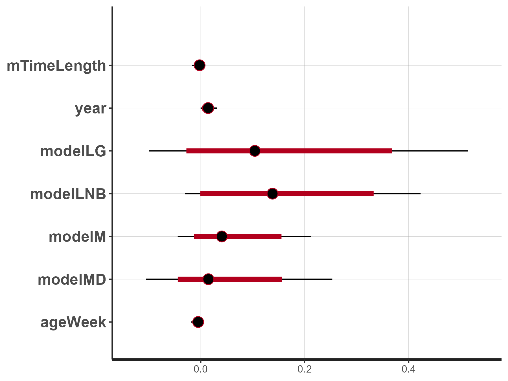
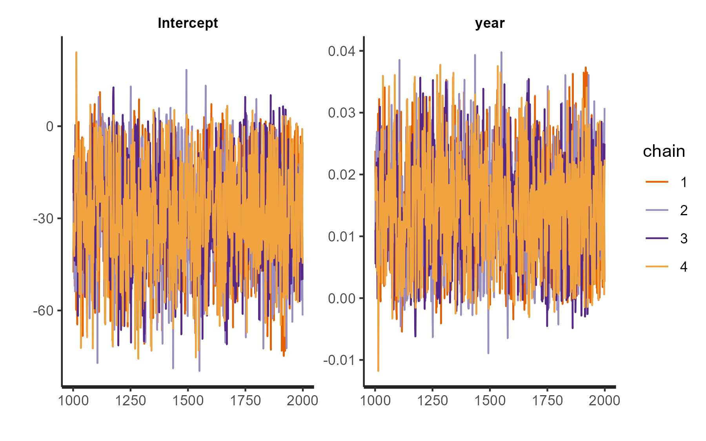
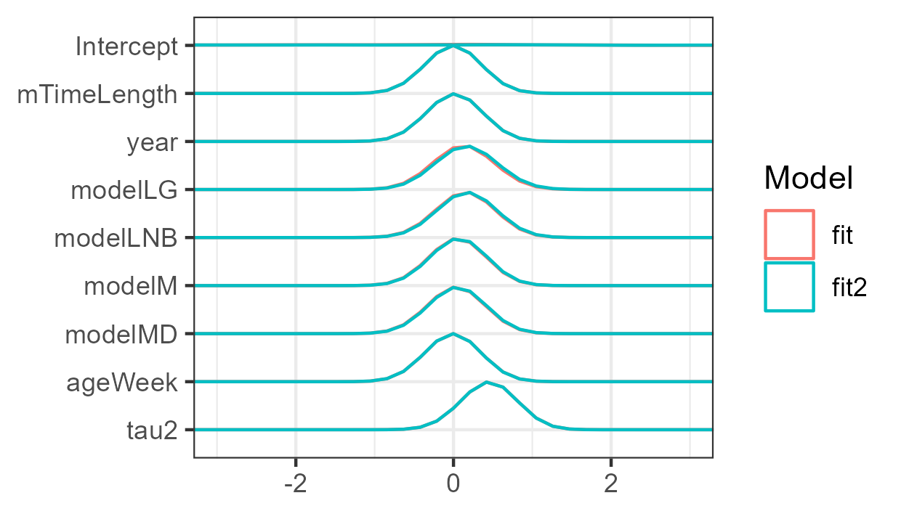

```{r setup, include = FALSE}
run_everything <- FALSE
library("papaja")
library(tidySEM)
library(kableExtra)
r_refs("r-references.bib")
out <- readRDS("output.RData")
```

```{r analysis-preferences}
# Seed for random number generation
set.seed(42)
knitr::opts_chunk$set(cache.extra = knitr::rand_seed, warning = FALSE, message = FALSE)
```

<!--
Skeleton lasso/pema paper
1.) What is Meta-analysis?
2.) What is meta-regression and how does it complement meta-analysis?
	a.) Introduce Moderators
	b.) Study Heterogeneity + Random Sampling Error (and their difference)	
2.5.) Fixed vs. random effects
	a.) Shortcomings of fixed effect models
3.) Shortcomings of current meta regressions w.r.t. estimating coefficients and heterogeneity:
	a.) Small sample size / overfitting
	b.) Non-normal data
4.) Various methods to estimate heterogeneity (and coefficients)
	a.) The use of WLS and REML
5.) Intro to Frequentist linear methods/Bayesian methods and Random forests, along with their 
(dis-)advantages:
	a.) Rma: uses WLS for estimation
	b.) MetaForest (Random Effects): Uses Random Forest Algorithm
	c.) Lasso Pema: uses penalized Lasso
	d.) Horseshoe Pema: uses horseshoe priors
6.) Goal of the current study
7.) Means of attaining goal and evaluation of performance:
	a.) simulation study
	b.) algorithmic performance
	c.) design factors
	d.) Impact of design factors on algorithim performance
	e.) Hypotheses of algorithmic performances

colour coding: I colour coded the text as to know from which file the text is copied
GREEN = derived from ‘Thesis_Metaforest’
BLUE = Thesis_lasso
BLACK = internship_report
RED = Inserted myself

# Introduction
--> 

<span id = "openingparagraph">A common application of meta-analysis is to summarize existing bodies of literature.
A crucial challenge is that there is often substantial heterogeneity between studies,
because similar research questions are studied in different labs,
sampling from different populations,
and using different study designs, instruments, and methods.
Any of those between-studies differences can introduce *systematic heterogeneity* in observed effect sizes.
Suspected causes of systematic heterogeneity can either be used as exclusion criteria,
or controlled for using *meta-regression* [see @lopez-lopezEstimationPredictivePower2014].
The latter approach provides an opportunity to learn which factors impact the effect size
found.
However, a limitation of meta-regression is that it requires a relatively high number of cases (studies) per parameter to obtain sufficient statistical power.
In applied meta-analyses, the number of available studies is often low [@rileyInterpretationRandomEffects2011].
This introduces a risk of overfitting,
which results in uninterpretable model parameters [@hastieElementsStatisticalLearning2009].
In extreme cases, the ratio of cases to parameters can be so low that the model is not (empirically) identified,
resulting in non-convergence [@akaikeNewLookStatistical1974].
Accounting for between-studies heterogeneity thus poses a non-trivial challenge to classic meta-analytic methods.
The risk of arriving at false-positive conclusions
when there are many potential moderators is so ubiquitous that it was referred to as the "primary pitfall" in meta-regression [@thompsonHowShouldMetaregression2002].
The present study introduces a novel method to overcome this pitfall by imposing Bayesian regularizing (LASSO and regularized horseshoe) priors on the regression coefficients.
These priors shrink the effect of irrelevant predictors towards zero while leaving important predictors relatively unaffected.
The result is a sparse model with fewer non-zero parameters,
which benefits model convergence, reduces overfitting, and helps identify relevant between-study differences.
</span>

## Variable selection

The "curse of dimensionality" refers to the aforementioned problems that arise when the number of moderators is high relative to the number of cases [@hastieElementsStatisticalLearning2009].
It can be overcome by performing *variable selection*:
identifying a smaller subset of relevant moderators from the larger set of candidate moderators [@hastieElementsStatisticalLearning2009].
<span id = "theory">Prior authors have stressed the need to perform variable selection in meta-regression,
for example, by limiting the number of moderators considered [@thompsonHowShouldMetaregression2002].
This does not resolve the problem, however,
as failing to consider a moderator does not mean that it is irrelevant.
Instead, moderators ought to be selected based on their theoretical or empirical relevance for the studied effect.

One approach is to select variables on theoretical grounds.
An important caveat is that theories that describe phenomena at the level of individual units of analysis do not necessarily generalize to the study level.
Using such theories for variable selection amounts to committing the ecological fallacy:
generalizing inferences across levels of analysis [@jargowskyEcologicalFallacy2004].
The implications of the ecological fallacy for interpreting the *results* of meta-regression are well-known [@bakerUnderstandingHeterogeneityMetaanalysis2009; @thompsonHowShouldMetaregression2002]:
For example, meta-regression may find a significant positive effect of average sample age on the effect size of a randomized controlled trial,
even if age is uncorrelated with treatment efficacy within each study.
Less well-known is that the same problem applies when using individual level theory to select study level moderators:
If theory states that an individual's age influences their susceptibility to treatment,
that does not imply that average sample age will be a relevant moderator of study-level treatment effect in meta-regression.
One rare example of study level theory is the *decline effect*:
effect sizes in any given tranche of the literature tend to diminish over time [@schoolerUnpublishedResultsHide2011].
When, by coincidence, a large effect is found, it initially draws attention from the research community.
Subsequent replications then find smaller effects due to regression to the mean.
Based on the decline effect, we might hypothesize "year of publication" to be a relevant moderator of study effect sizes.
At present, few such study level theories about the drivers of heterogeneity exist, and until they are developed,
theory has limited utility for variable selection.</span>
A further complication is that theoretically relevant variables might not be reported in many published papers,
which may be one reason why moderator analyses are rarely executed as planned [@thompsonHowShouldMetaregression2002]

An alternative solution is data-driven variable selection using appropriate statistical techniques.
This is a focal issue in the discipline of machine learning [@hastieElementsStatisticalLearning2009].
There is precedent for the use of machine learning for variable selection in meta-analysis [@vanlissaSmallSampleMetaanalyses2020].
This prior work used the non-parametric *random forest* algorithm.
A limitation of random forests is that its results are harder to interpret than linear models,
which describe the effect of each moderator with a single parameter.
The present study instead uses *regularization*,
which is a method for variable selection in linear models.
Regularization shrinks small model parameters towards zero,
such that irrelevant moderators are eliminated.
Different approaches to regularization exist [@hastieElementsStatisticalLearning2009].
<span id = "lassointroduction">The present paper introduces *Bayesian Regularized Meta-Regression* (BRMA),
an algorithm that uses Bayesian regularizing priors to perform variable selection in meta-analysis.
Regularizing priors assign a high probability density to near-zero values,
which shrinks small regression coefficients towards zero, thus resulting in a sparse solution.
This manuscript discusses two shrinkage priors,
the LASSO and regularized horseshoe prior.</span>

## Statistical underpinnings

To understand how BRMA estimates the relevant parameters and performs variable selection,
it is instructional to first review the statistical underpinnings of classical meta-analysis.
In its simplest form, meta-analysis amounts to computing a weighted average of the effect sizes.
Each effect size is assigned a weight that determines how influential it is in calculating the summary effect.
The weights are based on specific assumptions.
For example, the *fixed effect* model assumes
that each observed effect size $T_i$ is an estimate of an underlying true population effect size $\beta_0$ [@hedgesFixedRandomeffectsModels1998].
This assumption is appropriate when meta-analyzing close replication studies [@higginsReevaluationRandomeffectsMetaanalysis2009a].
The only cause of heterogeneity in observed effect sizes is presumed to be sampling error, $v_i$, which is treated as known, and computed as the square of the standard error of the effect size.
Thus, for a collection of $k$ studies,
the observed effects sizes of individual studies $i$ (for $i \in [1,2, \ldots k]$) are given by:
\begin{align}
T_i &= \beta_0 + \epsilon_i\\
\text{where } \epsilon_i &\sim N(0, v_i)
\end{align}
The estimated population effect size $\hat{\beta_0}$ is then a weighted average of the observed effect sizes.
The assumption that sampling error is the only source of variance in observed effect sizes implies that studies with smaller standard errors estimate the underlying true effect size more precisely and should accrue more weight.
Therefore, fixed effect weights are simply the reciprocal of the sampling variance, $w_{i} =  \frac{1}{v_i}$.
The estimate of the true effect is a weighted average across observed effect sizes:
\begin{equation}
\hat{\beta_0} = \frac{\sum_{i=1}^k w_iT_i}{\sum_{i=1}^k w_i}
\end{equation}

The *random effects* model, by contrast, assumes that,
in addition to sampling error, true effects vary for random reasons,
and thus follow a normal distribution with mean $\beta_0$ and variance $\tau^{2}$ [@hedgesFixedRandomeffectsModels1998].
This assumption is appropriate when studies are conceptually similar but differ in small random ways [@higginsReevaluationRandomeffectsMetaanalysis2009a]. 
The observed effect sizes are thus given by:
\begin{align}
T_i &= \beta_0 + \zeta_{i} + \epsilon_i\\
\text{where } \zeta_i &\sim N(0, \tau^2)\\
\text{and } \epsilon_i &\sim N(0, v_i)
\end{align}
In this model, the error term $\zeta_{i}$ represents between-studies heterogeneity, with variance $\tau^2$.
As in the fixed effect model,
studies with smaller sampling errors are assigned more weight.
<span id = "informationdistribution">In contrast to the fixed effect model, the random effects model assumes that all studies provide some information about the underlying distribution of true effect sizes.
Fixed effect weights would discount the information smaller studies provide about the scale of this distribution, which is represented by its variance $\tau^2$.
To overcome this limitation, the weights are attenuated in proportion to the variance.
The random effects weights are thus given by $w_{i} =  \frac{1}{v_i + \hat{\tau}^2}$.</span>
Whereas sampling error is still treated as known,
the between-study heterogeneity $\tau^{2}$ must be estimated.
This estimate is represented by $\hat{\tau}^{2}$.

Between-studies heterogeneity is not always random, however.
Meta-regression extends the random effects model to account for systematic sources of heterogeneity,
which are coded as moderators.
It estimates the effect of moderators on effect size,
and provides an estimate of the overall effect size and residual heterogeneity after controlling for their influence.
For example, if studies have been conducted in Europe and the Americas,
one could code a binary moderator variable called "continent".
Using meta-regression, one can then estimate either the continent-specific effect size,
or control for the difference between continents when estimating the overall average effect size.
Similarly, if studies have examined the effect of a drug at different dosages,
one could code dosage as a continuous moderator and estimate the overall effect size at average dosages,
or at a specific dosage.
The equation below describes a general model for $p$ moderators,
where $x_{1\ldots p}$ represent the moderator variables,
and $\beta_{1\ldots p}$ their regression coefficients.
Note that $\beta_0$ now represents the intercept of the distribution of true effect sizes after controlling for the moderators.
This is a mixed-effects model; the intercept and effects of moderators are treated as fixed and the residual heterogeneity as random [@lopez-lopezEstimationPredictivePower2014]:
\begin{align}
T_i &= \beta_{0}+ \beta_{1}x_{1}+ \beta_{2}x_{2} + \ldots + \beta_{p}x_{p} + \zeta_{i} + \epsilon_i
\end{align}

### Regularized regression

Meta-regression models are most commonly estimated using weighted least squares,
with weights determined according to the aforementioned random effects model,
where residual heterogeneity is estimated using restricted maximum likelihood [@pattersonRecoveryInterblockInformation1971; @viechtbauerBiasEfficiencyMetaAnalytic2005].
This approach, henceforth referred to as RMA, has low bias, which means that, across hypothetical replications of a study, the average values of model parameters are close to their true population values [@panityakulEstimatingResidualHeterogeneity2013].
Low bias comes at the cost of higher variance, however,
which means that the estimated values of population parameters vary more from one hypothetical replication to the next.
This phenomenon is known as the *bias-variance trade-off*.
In general, an estimator with low bias and high variance produces results that generalize less well to new data than an estimator with high bias and low variance.
Regularized approaches to regression intentionally increase bias in order to reduce variance.
This is a sensible approach in the context of small samples, which are common in meta-analyses,
because small samples incur a high risk of overfitting,
and typically have relatively high levels of multicollinearity,
due to the higher probability that extreme values on one moderator coincide with extreme values on another.
In such cases, regularized regression reduces the risk of overfitting and increase generalizability of the results [see @hastieElementsStatisticalLearning2009].

<span id = "reftibshirani">To understand how regularized regression introduces bias, consider a comparison between ordinary least squares regression and LASSO regression [for a more elaborate introduction, see @tibshiraniRegressionShrinkageSelection2011].</span>
Ordinary least squares regression (OLS) estimates model parameters by minimizing the Residual Sum of Squares (RSS) of the outcome variable, given by the formula below.
In this equation, $n$ is the number of participants; $y_i$ is the outcome variable, and $x$ is one of $p$ predictor variables.
\begin{align}
RSS=\sum_{i=1}^{n}(y_{i} - \beta_{0} - \sum_{j=1}^{p}\beta_{j}x_{ij})^2
\end{align}
The resulting parameter estimates perfectly describe linear relations in the present data set, but generalize less well to new data.
Regularized regression biases parameter estimates towards zero by adding a penalty term to the RSS.
Most common is the LASSO penalty, which consists of the sum of the absolute regression coefficients, or the L1 norm [@hastieElementsStatisticalLearning2009].
As the LASSO penalty is a function of the regression coefficients, it increases when they get bigger.
This incentivizes the optimizer to keep the regression coefficients as small as possible.
The amount of regularization can be controlled by multiplying the penalty by a tuning parameter, $\lambda$.
If $\lambda$ is zero, the shrinkage penalty has no impact.
As $\lambda$ increases,
all coefficients shrink towards zero, ultimately producing the null model.
Cross-validation is often used to find the optimal value for the penalty parameter $\lambda$.
The LASSO penalized residual sum of squares is given by:
\begin{align}
PRSS= RSS + \lambda \sum_{j=1}^{p}|\beta_{j}| (\#eq:prss)
\end{align}
<span id = "whylasso">Note that many other regularizing penalties exist.
This introduction focuses on the LASSO penalty because it is most ubiquitous, easy to understand,
and has an analogue in Bayesian estimation,
as explained in the next section.</span>

<span id = "earlierpapers">Some seminal studies have applied the LASSO to perform moderator selection in meta-regression [@rosettieCosteffectivenessHPVVaccination2021; @sebriNaturalResourcesIncome2021; @requiaGlobalAssociationAir2018].
This suggests that others have recognized its potential for exploring heterogeneity when the number of moderators is relatively high to the number of studies.
However, these existing publications have taken a two-step approach, whereby moderators are first selected using LASSO regression,
and selected moderators are then included in meta-regression analysis.
This approach is fraught; firstly, because of known problems of inference after variable selection [@zhangInferenceVariableSelection1992].
As the moderators included in the second step are based on an exploratory first step,
their parameters are not valid for inference.
Secondly, although the LASSO model in the first step accounts for potential multicollinearity by including all colinear variables but restricting the size of their coefficients,
the meta-regression in the second step no longer does so.
A three-step extension of the two-step approach exists
that uses principles from the causal inference literature to overcome these limitations [@belloniInferenceTreatmentEffects2014].
BRMA, by contrast, overcomes these limitations by introducing a one-step approach that performs inference within the penalized framework.</span>

### Bayesian estimation

<span id = "morepriors">An alternative to the use of a shrinkage penalty is Bayesian estimation with a regularizing prior.
Whereas the aforementioned (frequentist) approaches treat every possible parameter value as equally plausible,
Bayesian estimation combines information from the data with a *prior distribution* that assigns a-priori probability to different parameter values.
Likely parameter values have a high probability density, and unlikely parameter values have a low probability density.
The prior distribution is updated with the likelihood of the data to form a posterior distribution,
which reflects expectations about likely parameter values after having seen the data.
<span id = "refmcelreath">For a more extensive introduction to Bayesian estimation, see @mcelreathStatisticalRethinkingBayesian2020.</span>

A regularizing prior distribution shrinks small coefficients towards zero by assigning high probability mass to near-zero values.
There are many different regularizing prior distributions,
some of which are analogous to specific frequentist methods [@vanErpOberskiMulder2019].
For example, a double exponential prior (hereafter: LASSO prior) results in posterior distributions whose modes are identical to the estimates from LASSO-penalized regression [@ParkCasella2008].
Both the the frequentist LASSO penalty and the Bayesian LASSO prior have a tuning parameter $\lambda$ that controls the amount of regularization.
In frequentist LASSO, its value is usually chosen via cross-validation [@hastieElementsStatisticalLearning2009]. 
In the Bayesian approach, by contrast,
its value can be optimized during model estimation.

<span id = "horseshoe">One limitation of the LASSO prior is that it biases all regression coefficients towards zero - for relevant as well as irrelevant moderators.
To overcome this limitation, regularizing priors with better shrinkage properties have been developed.
These priors still pull small regression coefficients towards zero,
but exert less bias on larger regression coefficients.
One example is the horseshoe prior [@CarvalhoPolsonScott2010].
It has heavier tails than the LASSO prior,
which means that it does not shrink (and therefore bias) substantial coefficients as much.
One limitation of the horseshoe prior is that it is difficult to specify a prior that ensures a sufficiently sparse solution.
The regularized horseshoe was introduced to overcome this limitation [@PiironenVehtari2017b].</span></span>

The BRMA method introduced here offers both LASSO and regularized horseshoe priors.
The LASSO prior is given by:
\begin{align}
\beta_{j} &\sim \text{DE}(0, \frac{s}{\lambda})\\ (\#eq:lasso)
\lambda &\sim \chi^2(0, \nu_1)
\end{align}
where DE denotes the double exponential distribution centered around zero,
with a scale determined by a global scale parameter $s$ that is multiplied by the inverse of tuning parameter $\lambda$.
Increasing the scale parameter extends the prior to cover more extreme values.
The inverse tuning parameter is estimated from the data 
by assigning it a $\chi^2$ prior distribution with mean zero and degrees of freedom $\nu_1$ [@vanErpOberskiMulder2019].
Increasing the degrees of freedom assigns greater probability mass to extreme values, resulting in less regularization.
The present study used default values for the prior parameters,
$s = 1$, $\nu_1 = 1$, as suggested by @vanErpOberskiMulder2019.

The regularized horseshoe prior combines global and local shrinkage of the regression coefficients with a finite slab that curtails the occurrence of very extreme values [@PiironenVehtari2017b].
For regression coefficients $\beta_j$, for $j \in [1\ldots p]$ where $p$ is the total number of moderators,
the regularized horseshoe prior is given by:
\begin{align}
\beta_{j} &\sim N(0, \tilde{\tau}_j^2\lambda) \text{, with}\\ (\#eq:hs)
\tilde{\tau}_j^2 &= \frac{c^2 \tau_j^2}{c^2 + \lambda^2 \tau_j^2}\\
\lambda &\sim \text{student-}t^+(\nu_1, 0, \lambda^2_0)\\
\tau_j &\sim \text{student-}t^+(\nu_2, 0, 1)\\
c^2 &\sim \Gamma^{-1}(\frac{\nu_3}{2}, \frac{\nu_3 s^2}{2})
\end{align}
Note that global shrinkage parameters, which are not subscripted, affect all regression coefficients.
Local parameters are indicated by subscript $_j$, and affect each individual regression coefficient separately.
In these equations, $N$ denotes the normal distribution,
student-$t^+$ denotes the positive half of a t distribution,
and $\Gamma^{-1}$ denotes the inverse Gamma distribution. 
In this formula, $\lambda$ controls the overall scale of the priors for all regression coefficients,
where larger values for the global scale parameter $\lambda^2_0$ widen the rande of values covered by the priors.
The global degrees of freedom $\nu_1$ control the overall thickness of the tails,
with higher values resulting in thinner tails, which assigning less probability mass to extreme values.
Lighter tails can aid model convergence when the model is weakly identified; for example, when there are more moderators than observations.
The prior $\tau_j$ controls the local shrinkage of specific regression coefficients;
its scale is fixed, but its degrees of freedom $\nu_2$ control the incidence of extreme values in a similar way as $\nu_1$.
A finite "slab" applies additional regularization to very large coefficients,
which provides greater numerical stability of the model.
This slab is governed by a degrees of freedom parameter $\nu_3$ and a scale parameter $s$.
As before, increasing $\nu_3$ assigns less probability mass to extreme values.
Increasing $s$ increases the range of values covered by the slab.

<span id = "expectedmods">An attractive property of this shrinkage prior is that it can incorporate prior information regarding the expected number of relevant moderators.
This is accomplished by calculating the scale of the global shrinkage parameter $\lambda^2_0$ based on the expected number of relevant moderators $p_{rel}$.
The shrinkage parameter is then given by $\lambda^2_0 = \frac{p_{rel}}{p-p_{rel}}{\frac{\sigma}{\sqrt{n}}}$,
where $\sigma$ is the residual standard deviation and $n$ equals the number of observations.</span>
The present study used default values for the prior parameters, as
proposed by its authors: $\lambda^2_0 = 1$, $\nu_1 = 1$, $\nu_2 = 1$, $\nu_3 = 4$, and $s = 2$ [@PiironenVehtari2017b].
<!-- Check if s should be 2! -->
<!-- SvE: nu twijfel ik toch weer of dit helemaal goed gaat. sigma is in ons model namelijk op 0 gezet en wordt hier dus niet in meegenomen. Klopt het dat de residual SD 0 moet zijn in dit model? De rest van de global scale wordt berekend buiten het Stan model om in de brma functie zelf. -->

<span id = "tauprior">
The choice of prior distributions is an important decision in any Bayesian analysis.
This also applies to the heterogeneity parameters.
In the case of random effects meta-regression,
the only heterogeneity parameter is the between-studies variance, $\tau^2$.
In the case of three-level multilevel meta-regression,
there is a within-study and between-studies variance.
A crucial challenge with heterogeneity parameters in meta-regression is that the number of observations at the within- and between-study level is often small.
This can result in poor model convergence [@roverWeaklyInformativePrior2021],
or boundary estimates at zero [@chungAvoidingZeroBetweenstudy2013].
A well-known advantage of Bayesian meta-analysis is that it can overcome these challenges by using weakly informative priors, which guide the estimator towards plausible values for the heterogeneity parameters.
There is less consensus, however, about which priors are most suitable for this purpose [@roverWeaklyInformativePrior2021].
BRMA uses a prior specifically developed for multilevel heterogeneity parameters
[@gelmanPriorDistributionsVariance2006]:
a half-Student's t distribution with large variance, 
$\text{student-}t^+(3, 0, 2.5)$.
Note that other relevant weakly informative priors have been discussed in the literature,
such as the Wishart prior [@chungWeaklyInformativePrior2015].
There has also been increasing interest in the use of informative priors for heterogeneity parameters,
which incorporate substantive knowledge about plausible parameter values [@thompsonGroupspecificPriorDistribution2020].
Informative priors exert substantial influence on the parameter estimates.
They thus differ from weakly informative priors,
which restrict the estimator towards possible values (e.g., by excluding negative values for the variance),
or guide it towards plausible values to aid model convergence.
BRMA takes a pragmatic approach to Bayesian analysis,
using weakly informative priors to aid convergence for heterogeneity parameters,
and regularizing priors to perform variable selection for regression coefficients.
The use of informative priors is out of scope for BRMA.
If researchers do wish to construct alternative prior specifications, they may want to develop a custom model in `rstan` instead [@rstan].
</span>

<span id = "intervals">The frequentist LASSO algorithm shrinks coefficients to be exactly equal to zero, and thus inherently performs variable selection.
Other approaches to regularization - frequentist or Bayesian - lack this property.
However, an advantage of the Bayesian approach is that its posterior distributions lend itself to exact inference.
One can use probability intervals to determine which population effects are likely non-zero;
for example, by selecting moderators whose 95% interval excludes zero.
Two commonly used Bayesian probability intervals are the credible interval and the highest posterior density interval [@mcelreathStatisticalRethinkingBayesian2020].
The credible interval (CI) is the Bayesian counterpart of a confidence interval,
and it is obtained by taking the 2.5% and 97.5% quantiles of the posterior distribution.
The highest posterior density interval (HDPI) is the narrowest possible interval that contains 95% of the probability mass [@kruschkeChapter12Bayesian2015].
When the posterior distribution is symmetrical,
the CI and HDPI are the same.
However, when the posterior is skewed,
the HPDI has the advantage that all parameter values within the interval have a higher posterior probability density than values outside the interval.
This suggests that the HPDI might be superior for performing inference on residual heterogeneity parameters, which have a skewed posterior distribution by definition.
For inference on regression coefficients, the choice of interval is likely less crucial.</span>

<!--To solve this model, the moderator coefficients and the residual heterogeneity must be estimated simulataneously.
<!--The topic of estimating the residual heterogeneity is a highly discussed one (Veroniki et al., 2016; Viechtbauer \& López-López, 2015; Panityakul et al., 2013). The ability of the estimators to predict the residual heterogeneity is influenced by different factors, such as the number of studies (Guolo \& Varin, 2017; Panityakul et al., 2013; Hardy \& Thompson, 1996) included and the sample size of the individual studies (Panityakul et al., 2013).
A third, and obvious factor, that is classified as relevant to model performance is heterogeneity among studies being meta-analysed (Kontopantelis \& Reeves, 2011; Jackson \& White, 2018). Coverage from models degrades when the residual heterogeneity increases, mostly when the amount of studies is small (Brockwell \& Gorden, 2001). Considering that all models their performance is linked to the accuracy of the estimate. According to Sidik \& Jonkman (2007), it is generally the case that the larger true between-study variance is, the more biased the estimate can be, which diminishes the performance of the method.-->
<!--Numerous methods have been proposed to accurately estimate the residual heterogeneity, including the Hedges (HE), DerSimonian–Laird/Method of Moments (DL), Sidik and Jonkman (SJ), Maximum Likelihood (ML), Restricted Maximum Likelihood (REML), and Empirical Bayes (EB) method. These methods are mostly divided into two groups: closed-form or non-iterative methods and iterative methods. The main difference between these groups is that the closed form group uses a predetermined number of steps to provide an estimation for the residual heterogeneity, whereas the iterative methods run multiple iteration, as the name suggests, to converge to a solution when a specific criterion is met. It is important to note that some iterative methods do not produce a solution when they fail to converge after a predetermined amount of iteration. 

In our scenario we are especially interested in an estimator which performs well under the condition of a relative low number of studies. The Restricted Maximum Likelihood (REML) seems to produce the lowest bias under this condition and is therefore preferred (Panityakul et al., 2013; Hardy & Thompson, 1996). The REML is an iterative method and needs a starting estimation of $\tau^{2}$ to start, usually it gets estimated by one of the non-iterative methods (Viechtbauer \& López-López, 2015). Besides the starting value of $\tau^{2}$, it needs in every iteration an estimation of the regression coefficients of the moderators. These are typically estimated by using the Weighted Least Squares (WLS) method. This is a variation of the Ordinary Least Squares (OLS), but in the case of meta-analysis it is necessary to assess weights to the coefficients. In systematic reviews large variation in standard errors is often observed, which will result in large heteroscedasticity in the estimation of the effects (Stanley \& Doucouliagos, 2017). The addition of weights is a way to adjust for this heteroscedasticity. The weights are formulated as presented in equation (5). 

The usage of a WLS method to estimate the regression coefficient may be problematic in the situation where a lot of moderators are measured without their specific effects, when the amount of studies is low and when moderators are dichotomous. The use of a least squares method will cause problems with the prediction accuracy and the model interpretability (James, Witten, Hastie, \& Tibshirani, 2013). In the situation where a lot of moderators are measured and blindly included in the model, it may as well be the case that variables are included that are in fact not associated with the response. Including irrelevant variables in the model lowers the interpretability of the model (James et al., 2013). An approach is necessary that automatically excludes the variables that are irrelevant i.e. performs variable selection. As explained before, in meta-analysis it is often the case that the number of moderators closely approaches or even exceeds the number of studies included in the analysis. A least squares method will display a lot variability in the fit when the number of variables is not much smaller than the number of studies (James et al., 2013). This means that the least squares method over fits the data and loses its power to be generalizable to future observations. When the number of variables exceeds the number of studies, the least squares method fails to produce one unique estimate and the method should not be used at all. 

However, a least squares method could still be somewhat valuable in some situations. It is extremely suitable to estimate a linear relationship. In the case of dichotomous moderators, the relationship is always perfectly linear. A powerful non-linear estimation tool is in the situation of dichotomous moderators unnecessary and would not perform better at all. Whenever a non-linear relation gets fitted on data with an underlying linear relation, it will cause problems when this fit gets used for the prediction of future data. Given the various arguments, this paper provides an approach to tackle this problem of the least squares methods whilst still making use of a linear method. The weighted least squares are replaced with the so-called LASSO regression for the estimation of the regression coefficients. This algorithm shrinks or penalizes the regression coefficients and performs variable selection (James et al., 2013; Hesterberg, Choi, Meier, \& Fraley, 2008). -->

<!--
**Intro rma**
The rma algorithm is part of the software-package `metafor` in `R`, which is developed by Wolfgang Viechtbauer (2010, 2019). This algorithm is specifically developed to perform a meta-analysis or meta-regression. It allows to include different models, such as the fixed-, random- and mixed-effect model. It is also possible to account for moderators (Viechtbauer, 2010). The mixed-effect model, which is used is this study, requires a two-step approach to fit a meta-analytic model. First the residual heterogeneity is estimated. The package developed by Viechtbauer does provide multiple methods for the estimation of the residual heterogeneity. In this study the Restricted Maximum-likelihood is used, but this has already been discussed earlier. The second step is estimating the moderator coefficients, which is done by using the Weighted Least Squares (WLS) method. The weights are described in equation (5). The lma is a variation of the rma algorithm which is created by Caspar van Lissa. As explained before, the REML is an iterative procedure for the estimation of the residual heterogeneity. In every step of the process, instead of estimating the coefficients of the moderators by using a WLS, a weighted lasso regression is performed. Then again, the residual heterogeneity gets estimated with the rma algorithm by using the new values of the coefficients. With these new values of $\tau^{2}$, a new weighted lasso is performed for the estimations of the coefficients. This process continuous, until the residual heterogeneity converges to a certain value. -->

### Standardizing predictors

As explained in Formula \@ref(eq:prss),
regularization penalizes all coefficients equally,
without regard for their scale.
If variables are on different scales,
this can lead to uneven penalization of coefficients in which
variables with smaller standard deviations are biased more strongly towards zero [@lee2015note].
If the scale of predictor $x$ is increased by a factor 10,
its regression coefficient is reduced by a factor 10,
bringing it closer to zero where it will be more affected by penalization.
Standardization is a widely used method for equalizing predictor scales [@gelmanScalingRegressionInputs2008a].
Standardization is a linear transformation that sets the mean of all predictors to 0 and their standard deviation to 1.
Like most other regularizing methods,
BRMA performs standardization by default [@tibshirani1996].
After parameters are estimated using standardized variables,
they can be restored to their original scales.
For the intercept, the transformation is:
$$
b_0 = b_{0Z} - \mathbf{b}_Z\frac{\bar{\mathbf{x}}}{\mathbf{s}_X}
$$
where $b_0$ is the intercept, $b_{0Z}$ is the intercept for the standardized predictors,
$\mathbf{\bar{x}}$ and $\mathbf{s}_{x}$ are the vectors of predictor means and variances,
and $\mathbf{b_Z}$ is the vector of regression coefficients for the standardized predictors.
The regression coefficients are returned to their original scale by applying:
$$
\mathbf{b}_x = \frac{\mathbf{b}_z}{\mathbf{s}_x}
$$

Note that standardization is not always necessary or desirable.
Standardization is not necessary if predictors are already on equivalent scales,
in which case penalization already affects them all equally.
There are additional considerations regarding standardization of categorical predictors [@alkharusi2012categorical].
As binary predictors can be straightforwardly included as predictors in linear models,
the most common way to represent categorical predictors is by choosing one response option as reference category,
and creating binary dummy variables to represent other response categories.
If these dummies are not standardized,
they might be unevenly penalized, as explained before.
However, standardizing dummy variables compromises the interpretability of their regression coefficients [@tibshiraniLassoMethodVariable1997; @wissmann2007role].
To illustrate this challenge, consider bivariate regression with a single binary predictor $x$ that takes on values 0 and 1 predicting outcome $y$.
The intercept represents the expected value of $y$ when $x$ is equal to zero, and the regression coefficient represents the difference in the expected value of $y$ between the two conditions [@alkharusi2012categorical].
By standardizing this binary predictor, the reference value is no longer zero, and both the intercept and its regression coefficient have no clear interpretation anymore.
Extending this example to the multivariate case further complicates the problem [@wissmann2007role].
The appropriate solution depends on the research goals;
if the primary goal is variable selection,
then the dummies should be standardized.
However, if the primary goal is interpretation of the coefficients,
they should not be [@gelmanScalingRegressionInputs2008a].
A related challenge is that, whereas various coding schemes for categorical predictors are equivalent in standard linear regression,
in penalized regression,
the coding scheme does affect model fit and interpretation of the coefficients [@chiquet2016coding; @detmer2020note].

### Intercepts

<span id = "intercept">The general linear model used in BRMA typically includes an intercept,
which reflects the expected value of the outcome when all predictors are equal to zero, and regression coefficients for the effect of moderators.
If the analysis contains categorical predictors, it may be desirable to omit this intercept.
To understand why, first consider the model with an intercept.
Standard practice is to encode category membership with dummy variables, with values $x \in \{0, 1\}$.
For a variable with $c$ categories, the number of dummy variables is equal to $c-1$.
The omitted category functions as a reference category, and its expected value is represented by the model intercept $b_0$.
The regression coefficients of the dummy variables, $b_{1\ldots c}$, indicate the difference between the expected values of the reference category and of the category represented by the dummy.
This is useful when there is a meaningful reference category.
For example, imagine a study on the effectiveness of interventions for specific phobia with two interventions: Treatment as usual, and a novel intervention.
In this case, it makes sense to code treatment as usual as the reference category,
and dummy-code the new contender.
The intercept $b_0$ then represents the average effect size of treatment as usual,
and the effect of the dummy $b_1$ indicates whether the newly developed intervention has a significantly different effect size from treatment as usual.
In other cases, there may not be a straightforward reference category.
For example, imagine a study on the effectiveness of one intervention for specific phobia in two continents.
In this case, it makes more sense to estimate the average effect for all continents separately - in other words, to conduct a multi-group analysis.
This is achieved by removing the intercept, and including all $c$ dummy variables.
In the context of standard linear regression, both approaches are equivalent,
but in regularized regression, shrinkage affects the intercept differently from the dummy variables.
Consequently, a reasoned choice must be made about whether to include an intercept or not.</span>

## Implementation

To facilitate adoption of the BRMA method in applied research,
we have implemented it in two software packages.
First, in the statistical programming language R [@rcoreteamLanguageEnvironmentStatistical2022].
R-users can install the package `pema`,
short for *pe*nalized *m*eta *a*nalysis, from CRAN by running `install.packages("pema")`.
Second, non-R-users can use BRMA via a graphical interface in the free, open source statistical program JASP [@JASP2022] via the menu option "Penalized Meta-Analysis", see Figure \@ref(fig:figjasp).

```{r figjasp, fig.cap="Using BRMA via the JASP software package." }
knitr::include_graphics("jasp.png")
```

For estimation, `brma()` depends on Stan, a probabilistic programming language that uses Hamiltonian Monte Carlo to sample from the posterior distribution [@rstan].
Stan is written in C++, and thus computationally efficient, but custom models must be compiled prior to estimation.
Installing a toolchain to compile models requires some technical sophistication, which potentially restricts the user base.
Moreover, model compilation adds unnecessary computational overhead for standard applications.
To overcome these limitations, the `pema` package includes pre-compiled stock models with opinionated default options.
At the time of writing, these include random effects and three-level meta-regression with and without an intercept.
R-users can refer to the package documentation to see what options are available at the time of reading by running `?pema::brma`.
Researchers who wish to construct a model that is currently out of scope of `brma()` are referred to `rstan` instead [@rstan].
As a starting point, the `rstan` source code for the stock models included with `pema` can be accessed by running `pema:::stanmodels`.
We welcome user contributions of additional models.

The function `brma()` has two main interfaces:
a formula interface, corresponding to base-R functions like `lm()`,
which allows the user to specify a model `formula` that references variables in a `data` argument.
The second interface is more amenable to machine learning applications,
and accepts an `x` matrix of predictors and a `y` vector of effect sizes.
Additionally, `brma()` has an argument `vi`, which refers to the effect size variances,
and `study`, which (optionally) refers to a clustering variable for three-level meta-regression.
Both of these arguments accept either the name of a column in `data`, or a numeric vector.

As mentioned before, the R-implementation of BRMA has several options that can be customized.
The most important option relates to the choice of priors for the regression coefficients.
At the time of writing, `brma()` supports two priors for regression coefficients: the LASSO and the regularized horseshoe.
A prior is selected using the `method` argument;
the `prior` argument is used to specify custom values for the prior hyperparameters (see Statistical underpinnings).
The parameters of the LASSO prior are explained in Equation \@ref(eq:lasso),
and those of the regularized horseshoe in Equation \@ref(eq:hs).
Table \@ref(tab:tabprior) provides an overview of the arguments that can be passed to `prior` to control these parameters,
along with a rudimentary description of the effect of increasing the value of each parameter.
<!-- The default values in this table correspond to the values used for the present simulation study, and are based on prior research [@vanErpOberskiMulder2019; @PiironenVehtari2017a]. -->

```{r tabprior, results='asis', eval = TRUE}
tab <- read.csv("prior_table.csv", stringsAsFactors = FALSE)
tab$Argument <- gsub("^`(.+?)`$", "\\\\texttt\\{\\1\\}", tab$Argument)
papaja::apa_table(tab, escape = FALSE, caption = "Prior parameters and corresponding arguments, along with their default values and the effect of increasing their values.")
```

Standardization is an important step in Bayesian regularized meta-analysis,
as explained before.
By default, `brma()` standardizes the predictor matrix,
and restores model coefficients to their original scale,
as explained in Statistical underpinnings.
There are two ways to circumvent this default standardization.
The first is to disable standardization entirely, analyzing predictors in their original scale,
by setting `standardize = FALSE`.
Alternatively, `brma()` allows custom standardization.
To use this option, first manually standardize (some of) the predictors.
Then, when calling `brma()`, provide the means (`means`) and standard deviations (`sds`) that should be used to restore coefficients to the predictors' original scale.
This can be accomplished using the argument `standardize = list(center = means, scale = sds)`.
For predictors that should not be standardized,
simply pass a mean of 0 and a standard deviation of 1;
this leaves the coefficient in question unaffected.

# Simulation study

We performed a simulation study to validate the BRMA algorithm.
As a benchmark for comparison, we used random effects meta-regression with restricted maximum likelihood estimation [RMA, @viechtbauerConductingMetaanalysesMetafor2010],
which is the current state-of-the-art in the field.
We evaluated the algorithms' predictive performance in new data, 
ability to perform variable selection,
and ability to recover population parameters.
Our research questions are whether BRMA offers a performance advantage over RMA in terms of any of these indicators,
and which prior (LASSO versus regularized horseshoe) is to be preferred.
<span id = "defaultvalues">For both Bayesian priors, we used default values proposed in prior literature, see Table \@ref(tab:tabprior).
Default values for the LASSO prior were based on @vanErpOberskiMulder2019,
and default values for the regularized horseshoe prior were based on @PiironenVehtari2017a.</span>
All analysis code is available in a version-controlled repository at <https://github.com/cjvanlissa/pema>.

## Performance indicators

<span id = "rsquared">Our primary performance indicator was predictive performance,
a measure of model generalizability.
To compute it, for each iteration of the simulation,
both a training data set and a testing data set are generated from the same known population model.
The number of cases in the training data vary according to the design factors of the simulation study.
The number of cases in the testing data set was always 100.
The models under evaluation (BRMA, RMA) were estimated on the training data,
and used to predict cases in the testing data.
Predictive performance was operationalized as the model's explained variance in the testing data, $R^2_{test}$, calculated as follows:
$$
R_{test}^{2} = 1- \frac{\sum_{i=1}^{k}(y_{i,test}-\hat{y}_{i,test})^{2}}{\sum_{i=1}^{k}(y_{i,test}-\bar{y}_{train})^{2}}
$$
Where $k$ is the number of studies in the testing data set, $\hat{y}_{i-test}$ is the predicted effect size for study $i$, and $\bar{y}_{train}$ is the mean of the training data.
The $R^2_{test}$ differs from the familiar $R^2$ metric:
$R^2$ describes the proportion of variance a model explains in the training data, and it always increases as the model becomes more complex.
By contrast, $R^2_{test}$ reflects the explained variance in the testing data.
Remember that BRMA was developed to reduce the risk of overfitting meta-regression models.
The $R^2_{test}$ is a useful metric to detect overfitting,
which causes it to decrease, or even become negative.
</span>

The algorithm's ability to perform variable selection was evaluated by estimating sensitivity and specificity.
Sensitivity $P$ is the ability to select true positives, or the probability that a variable is selected, $S = 1$, given that it has a non-zero population effect: $P = p(S = 1||\beta| >0)$.
Specificity is the ability to identify true negatives, or the probability that a variable is not selected given that it has a zero population effect: $N = p(S = 0|\beta  = 0)$.

The ability to recover population parameters $\beta$ and $\tau^2$ was examined in terms of bias and variance of these estimates.
The bias is given by the deviation of the estimate from the known population value,
and the variance is given by the variance of this deviation across replications of the same simulation conditions.

## Design factors

<span id = "designfactors">To examine performance in a range of realistic meta-analysis scenarios,
seven design factors were manipulated:
First, we manipulated the number of studies in the training data $k \in (20, 40, 100)$. 
Second, the average within-study sample size $\bar{n} \in (40, 80, 160)$. 
Third, 
true effect sizes were simulated according to two models:
one with a linear effect of one moderator, $T_{i}= \beta x_{1i} + \epsilon_i$, and one with a non-linear (cubic) effect of one moderator, $T_{i}= \beta x_{1i} + \beta x_{1i}^{2} + \beta x_{1i}^{3} + \epsilon_i$,
where $\epsilon_i \sim N(0, \tau^2)$.
As both BRMA and RMA assume linear effects,
simulating data from a non-linear model allows us to examine how robust the different methods are to violations of this assumption.
The fourth design factor was the population effect size $\beta$ in the aforementioned models, with $\beta \in (0, .2, .5, .8)$. 
Fifth, we manipulated the residual heterogeneity $\tau^2$ in the aforementioned models, with $\tau^{2} \in (.01, .04, .10)$.
According to a review of 705 published psychological meta-analyses (Van Erp et al., 2017),
these values of $\tau^2$ fall within the range observed in practice.
Sixth, we varied the number of moderators not associated with the effect size $M \in (1, 2, 5)$.
These are the moderators that ought to be shrunk to zero by BRMA.
Note that the total number of moderators is $M+1$,
as one moderator is used to compute the true effect size (see the third design factor).
Finally, moderator variables were simulated as skewed normal moderators, with scale parameter $\omega \in (0, 2, 10)$, where $\omega = 0$ corresponds to the standard normal distribution.</span>
All unique combinations of these design factors produced `r out$conditions` unique conditions.
For each simulation condition, 100 data sets were generated.
In each data set, the observed effect size $y_i$ was simulated as a standardized mean difference (SMD),
sampled from a non-central $t$-distribution.

<!-- **het aantal moderatoren is redelijk laag; ik zou vooral nog voordelen van brma verwachten met meer moderatoren maar is dat realistisch in de praktijk? Zo ja, dan is het iets om te noemen in de discussie** hier ook nog een eerdere comment. Mocht je een keer een toepassing tegenkomen met echt veel moderatoren, kan het interessant zijn hier nog een kleine simulatie op te baseren. Een voorbeeld kan zijn een set van moderatoren die de kwaliteit van studies proberen te vatten zoals we laatst hebben besproken -->


<!-- x = rnorm(1000) -->
<!-- func <- function(x, b){b*x+(b*(x^2))+(b*(x^3))} -->
<!-- dat <- data.frame(x = x, -->
<!--                   y = c(func(x, .2), func(x, .5), func(x, .8)), -->
<!--                   es = rep(c(".2", ".5", ".8"), each = 1000)) -->
<!-- ggplot(dat, aes(x, y, color = es))+geom_smooth() -->

# Results

## Missing data

Any iterative algorithm is susceptible to convergence problems.
In such cases, the BRMA algorithms provide warning messages,
but still return samples from the posterior.
We were thus able to use all iterations of the BRMA algorithms,
although some may have failed to converge, which would negatively impact BRMA's performance.
When the RMA algorithm fails to converge, however,
it terminates with an error.
<!-- To handle this contingency, we automated some of the steps recommended [on the `metafor` website](https://www.metafor-project.org/doku.php/tips:convergence_problems_rma). -->
<!-- This means that, in case of convergence  -->
The RMA algorithm failed to converge in `r out$missing` replications,
all characterized by low number of cases ($k \leq 40$) and high effect sizes $\beta \geq .5$.
They were omitted from further analysis.

## Predictive performance
```{r}
out <- readRDS("output.RData")
whichhi <- prop.table(out$which_highest)
```

Within data sets, the BRMA with a horseshoe prior had the highest predictive performance $R^2_{test}$ `r round(whichhi[1]*100)`% of the time, followed by RMA, `r round(whichhi[3]*100)`%, and finally BRMA with a LASSO prior, `r round(whichhi[2]*100)`%.
Across data sets, the average $R^2_{test}$ was highest for BRMA with a horseshoe prior and lowest for RMA, see Table \@ref(tab:tabr2).
This difference was driven in part by the fact that explained variance was somewhat higher for the BRMA models when the true effect was non-zero (i.e., in the presence of a population effect),
and by the fact that RMA had larger negative explained variance when the true effect was equal to zero (i.e., there was no population effect to detect).

```{r tabr2, results= "asis"}
tab <- read.csv("r2.csv")[1:7][c(1, 2,5,3,6,4,7)]
#[, c(seq(1, 9, by = 3), seq(2, 9, by = 3),
#                                                                  seq(3, 9, by = 3))]
names(tab)[1] <- ""
names(tab) <- gsub(".", " ", names(tab), fixed = T)
names(tab)[grepl("Mean", names(tab))] <- paste0(names(tab)[grepl("Mean", names(tab))], "}$")
names(tab) <- gsub("Mean R2", "$\\bar{R^2}_{", names(tab), fixed = T)
names(tab) <- gsub("SD R2.*", "$SD$", names(tab))
names(tab) <- gsub("CI.*", "$CI_{95}$", names(tab))
kbl(tab[, ], caption = "Mean and SD of predictive R2 for BRMA with a horseshoe (HS) and LASSO prior, and for RMA, for models with a true effect (ES != 0) and without (ES = 0).", digits = 2, row.names = FALSE, escape = FALSE, booktabs = TRUE, col.names = gsub("\\.\\d", "", names(tab)))
  
```

The effect of the design factors on $R^2_{test}$ was evaluated using ANOVAs.
Note that p-values are likely not informative due to the large sample size and violation of the assumptions of normality and homoscedasticity.
The results should therefore be interpreted as descriptive, not inferential, statistics.
Table \@ref(tab:tabr2eta) reports the effect size $\eta^{2}$ of simulation conditions on $R^2_{test}$.
<!-- for main effects and two-way interactions between simulation conditions. -->
<!-- , -->
<!-- we provide an overview of the interpretation of those effects in the Table. -->
<!-- For interaction effects, we report whether the interaction was spreading -->
<!-- Interpretation was less straightforward for a number of interactions; -->
<!-- for these, the median $R^2_{test}$ is graphed in Figure \@ref(fig:figanova). -->

```{r tabr2eta, results= "asis", eval = TRUE}
tabanova <- readRDS("anova.RData")
tabanova <- tabanova[!grepl(":", tabanova$condition), ]
tabanova$Interpretation[!tabanova$Interpretation %in% c("positive", "negative", "other")] <- NA
#tabanova$condition <- gsub("alpha", "omega", tabanova$condition, fixed = T)
#tabanova$condition <- gsub("$mean{n}$", "$n$", tabanova$condition, fixed = T)
tabanova$Factor <- gsub("\\$(omega|beta|tau)", "\\$\\\\\\1", tabanova$Factor)
#tabanova$HS.vs..LASSO <- NULL
tabanova <- tabanova[, c(ncol(tabanova), 2:(ncol(tabanova)-1))]
# kbl(tabanova, caption = "Effect size of design factors and their two-way interactions on R2 the different algorithms, and of the difference between algorithms. The comparison between HS and LASSO was zero in the second decimal for all conditions. Interpretation indicates whether the effect was uniformly positive or negative (for interactions, the effect of the second design factor in the interaction) for all algorithms.", digits = 2, row.names = FALSE, escape = FALSE, booktabs = TRUE, col.names = gsub("(?<!vs)\\.", " ", names(tabanova), perl = TRUE)) |>
#   kable_styling(latex_options = c("scale_down"))
#tabanova <- tabanova[!grepl(":", tabanova$condition, fixed = T), ]
apa_table(tabanova, caption = "Effect size of design factors on predictive R2 of the different algorithms, and of the difference between algorithms. Interpretation indicates whether a main effect was uniformly positive or negative across all algorithms.", digits = 2, escape = FALSE, col.names = gsub("(?<!vs)\\.", " ", names(tabanova), perl = TRUE))#, longtable = TRUE)
# Interpretation for main effects indicates whether the effect was uniformly positive or negative or other, and for interactions, whether it is a spreading or crossover interaction.
```
```{r figr2, fig.cap="Predictive R2 for BRMA with horseshoe (HS) and LASSO prior, and RMA. Plots are sorted by largest performance difference between BRMA and RMA."}
knitr::include_graphics("r2.png")
```

```{r figanova, fig.cap="Predictive R2 for HS (circle, solid line), LASSO(triangle, dotted line) and RMA (square, dashed line) for interactions. One design factor is displayed in different panels, the other on the x-axis.", eval = FALSE}
knitr::include_graphics("other_effects.png")
```

To test our research questions, we computed interactions of algorithm (HS vs. LASSO, HS vs. RMA and LASSO vs. RMA) with the other design factors.
The $\eta^2$ of these differences between algorithms are also displayed in Table \@ref(tab:tabr2eta).
Note that $\eta^2$ for the comparison between HS and LASSO was zero in the second decimal for all conditions; thus, this comparison was omitted from the Table.
The effect of design factors by algorithm is displayed in Figure \@ref(fig:figr2); these plots have been ranked from largest difference between BRMA and RMA to smallest.
Results indicate that the largest differences between algorithms were due to the effect size $\beta$, number of irrelevant moderators $M$, and the number of cases in the training data $k$.
Evidently, predictive performance increased most for the HS algorithm when the effect size increased above zero.
As previously noted, predictive performance of RMA was the most negative when the effect size was zero.
This means that RMA's explained variance in new data was below zero, a clear indication of overfitting.
The HS algorithm furthermore had the consistently highest predictive performance regardless of number of irrelevant moderators or number of cases in the training data, and was relatively less affected by increases in the number of irrelevant moderators (panel b) or in the number of training cases (panel c).
<!-- Similarly, the HS algorithm furthermore had the consistently highest predictive performance regardless of number of cases in the training data, and thus also increased less when the number of training cases increased (panel c). -->
Conversely, RMA had relatively poor predictive performance on average, and was more responsive to increases in the number of training cases and irrelevant moderators.
<!--However, differences between the algorithms were generally small. CJ: Niet mee eens; de verschillen zijn misschien klein in termen van de substantieve interpretatie van R2, maar de grootte van dat verschil hangt af van de gebruikte simulatie condities. Je kan dus een groter verschil aantonen als je daarmee gaat spelen, en een situatie opzoekt die ongunstiger is voor RMA. Belangrijker is dat we uberhaupt een consequent voordeel van BRMA over RMA aantonen-->

```{r figmaindif, fig.cap="Predictive R2 for design factors with largest differences in predictive performance across the HS (circle, solid line), LASSO(triangle, dotted line) and RMA (square, dashed line) algorithms.", eval = FALSE}
knitr::include_graphics("main_diff.png")
```

<!-- Results show that the true effect size $\beta$ had the largest marginal effect on $R^{2}$ for all algorithms. -->
<!-- As $\beta$ increased, each algorithm's performance increased as well. -->
<!-- Predictably, the effect of $\beta$ interacted with the model used to simulate data. -->
<!-- Compared to the linear model, $R^{2}_{test}$ for the cubic model showed diminishing increases with $\beta$. -->
<!-- The third largest marginal effect was that of the simulation model. -->
<!-- All algorithms had higher $R^2_{test}$ under the cubic model than under the linear model, which makes sense because $\beta$ had an additional effect through the polynomials of the relevant moderator. -->
<!-- There was an interaction between the model and the amount of skewness of the predictor variable $\omega$: -->
<!-- For all algorithms, the association between skewness and $R^2_{test}$ was negative for the linear model, and positive for the cubic model. -->
<!-- <!-- Figure \@ref(fig:skewness) shows the relationship. -->
<!-- The residual heterogeneity $\tau^{2}$ had a negative linear relationship with $R^{2}_{test}$ for all algorithms. -->
<!-- The mean sample size per study $\bar{n}$ also had a moderate effect for all algorithms, indicating that a greater number of participants within studies was positively linearly related with $R^{2}_{test}$. -->
<!-- Similarly, the number of studies in the training data $k$ was positively related with $R^{2}_{test}$. -->

<!-- Finally, the number of moderators did not have a big effect for the Pema algorithms, while for RMA and MetaForest the effect was more noticeable. The relationship is shown in image 7. The relationship is generally negative with more moderators meaning worse performance, although an increase can be observed as the number of moderators increase from 4 to 6 for all algorithms except MetaForest. This increase in performance for MetaForest appears when the number of moderators go from 3 to 4. -->


## Variable selection
```{r}
selprob <- out$selection
colnames(selprob) <- c("HS", "LASSO", "RMA")
truepos <- paste0(sapply(order(selprob[1,], decreasing = TRUE), function(i)paste0("$P_{", colnames(selprob)[i], "}", report(selprob[1,i]), "$")), collapse = ", ")
trueneg <- paste0(sapply(order(selprob[2,], decreasing = TRUE), function(i)paste0("$N_{", colnames(selprob)[i], "}", report(selprob[2,i]), "$")), collapse = ", ")
proboveral <- colMeans(selprob)
proboveral <- paste0(sapply(order(proboveral, decreasing = TRUE), function(i)paste0("$Acc_{", colnames(selprob)[i], "}", report(proboveral[i]), "$")), collapse = ", ")
```

To determine the extent to which the algorithms could perform variable selection correctly,
we calculated sensitivity $P$,
the ability to detect a true population effect,
and specificity $N$,
the ability to correctly estimate a null-effect at zero.
We used all simulation conditions with $\beta > 0$,
such that the population effect of the first moderator was always positive and that of the second moderator was always zero,
and calculated $P$ from the effect of the first moderator,
and $N$ from the effect of the second moderator.
Finally, we computed overall accuracy as $Acc = (P+N)/2$,
which reflects the trade off between sensitivity and specificity.

As the regularizing algorithms shrink all coefficients towards zero,
it is unsurprising that sensitivity was highest for RMA,
followed by HS and LASSO, `r truepos`.
By contrast, specificity was higher for the regularizing algorithms, `r trueneg`.
Overall accuracy was approximately equal for RMA and HS, and was lower for LASSO, `r proboveral`.

Cramer's V, an effect size for categorical variables, was used to examine the effect of design factors on sensitivity (Table \@ref(tab:tabcramerp), Figure \@ref(fig:figsensitivity)) and specificity (Table \@ref(tab:tabcramern), Figure \@ref(fig:figspecificity)).
We also computed this effect size for the difference between algorithms in the number of true positives by design factor.
Differences in sensitivity between the algorithms were near-zero for HS and LASSO.
The difference between the two BRMA algorithms and RMA were largest for the design factor effect size $\beta$, followed by the model and number of studies $k$.
For specificity, differences in sensitivity between HS and LASSO were largest for the number of noise moderators $M$, followed by the effect size $\beta$, number of studies $k$, and residual heterogeneity $\tau^2$.
The difference between the two BRMA algorithms and RMA were largest for the design factor number of studies $k$, followed by the model, the number of noise moderators $M$, and the effect size $\beta$.
Also note that the association between design factors and specificity was not monotonously positive or negative across algorithms.
Instead, some design factors had opposite effects for the two BRMA algorithms versus RMA.
For instance, a larger number of studies $k$ had a negative effect on specificity for the BRMA algorithms, but a positive effect for RMA - within the context that RMA had lower specificity on average.
Conversely, a greater number of noise moderators $M$ had a positive effect on specificity for BRMA, but a negative effect for RMA.
```{r tabcramerp, results= "asis", eval = TRUE}
tabselect <- readRDS("selected.RData")
rownames(tabselect) <- NULL
names(tabselect) <- gsub("(?<!vs)\\.", " ", names(tabselect), perl = TRUE)
apa_table(tabselect, caption = "Effect size (Cramer's V) of design factors, and of the difference between algorithms, on sensitivity (P).", digits = 2, escape = FALSE)#, longtable = TRUE)
# Interpretation for main effects indicates whether the effect was uniformly positive or negative or other, and for interactions, whether it is a spreading or crossover interaction.
```
```{r figsensitivity, fig.cap="Sensitivity by design factors for the HS (circle, solid line), LASSO(triangle, dotted line) and RMA (square, dashed line) algorithms."}
knitr::include_graphics("sensitivity.png")
```
```{r tabcramern, results= "asis", eval = TRUE}
tabselectn <- readRDS("notselected.RData")
rownames(tabselectn) <- NULL
names(tabselectn) = gsub("(?<!vs)\\.", " ", names(tabselectn), perl = TRUE)
apa_table(tabselectn, caption = "Effect size (Cramer's V) of design factors, and of the difference between algorithms, on specificity (N).", digits = 2, escape = FALSE)#, longtable = TRUE)
```
```{r figspecificity, fig.cap="Specificity by design factors for the HS (circle, solid line), LASSO(triangle, dotted line) and RMA (square, dashed line) algorithms."}
knitr::include_graphics("specificity.png")
```

## Ability to recover population parameters

The ability to recover population parameters $\beta$ and $\tau^2$ was examined in terms of bias and variance of these estimates.
If the value of the regression coefficient as estimated by one of the algorithms is $\hat{b}$,
then the bias $B$ and variance $V$ of this estimate can be computed as $\hat{b}-\beta$,
and as the variance of $\hat{b}$ across replications of the simulation for each unique combination of design factors, respectively.
For the estimated regression coefficients,
HS had the greatest (negative) bias across simulation conditions, $B_{HS} `r report(out[["beta_bias"]][["hs_beta1"]])`$, 
followed by LASSO, $B_{LASSO} `r report(out[["beta_bias"]][["lasso_beta1"]])`$.
Surprisingly, RMA also had negatively biased estimates, $B_{RMA} `r report(out[["beta_bias"]][["rma_beta1"]])`$.
The effect of the design factors on the bias in estimated $\beta$ was evaluated using ANOVAs.
Table \@ref(tab:tabbeta) reports the effect size $\eta^{2}$ of simulation conditions on the bias.
The skewness of moderator variables had the largest effect on bias in estimated $\beta$ for all algorithms.
This was mainly because the algorithms overestimated $\tau^{2}$ most when the data-generating model contained cubic terms.
Simulating data with a cubic model violates the model's assumption of linearity, which biases the estimated parameters.
No differences between algorithms in the effect of design factors were observed.

<span id = "variancebeta">The variance of parameter estimates cannot be calculated on a case-by-case basis.
Instead, it is calculated across replications for each simulation condition.
Across simulation conditions, parameters estimated via HS had the lowest variance, $V_{HS} `r report(out[["beta_variance"]][["hs_beta1"]])`$, followed by LASSO, $V_{LASSO} `r report(out[["beta_variance"]][["lasso_beta1"]])`$,
and then RMA, $V_{RMA} `r report(out[["beta_variance"]][["rma_beta1"]])`$.
Online [Supplemental Table S1]() provides an overview of the effect size of design factors on variance of the regression coefficients.
Notably, the differences between algorithms are very small;
the largest effect sizes were observed for the difference between HS and RMA in the effects of effect size, sample size, and model, all with $\eta^2 < 0.01$.</span>

```{r tabbeta, results= "asis", eval = TRUE}
tabbeta <- readRDS("table_beta.RData")
tabbeta$Factor <- gsub("\\$(omega|beta|beta)", "\\$\\\\\\1", tabbeta$Factor)
tabbeta <- tabbeta[, c(ncol(tabbeta), 2:(ncol(tabbeta)-1))]
apa_table(tabbeta, caption = "Effect size of design factors on bias in beta squared for the different algorithms, and of the difference between algorithms.", digits = 2, escape = FALSE, col.names = gsub("(?<!vs)\\.", " ", names(tabbeta), perl = TRUE))
```

Across all simulation conditions, HS had the lowest bias for the residual heterogeneity $\tau^2$,
$B_{HS} `r report(out[["tau2_bias"]][["hs_tau2"]])`$,
followed by RMA, $B_{RMA} `r report(out[["tau2_bias"]][["rma_tau2"]])`$,
and then LASSO, $B_{LASSO} `r report(out[["tau2_bias"]][["lasso_tau2"]])`$.
Note that all algorithms yielded positively biased estimates. The effect of the design factors on the bias in $\tau^2$ was evaluated using ANOVAs.
Table \@ref(tab:tabtau2) reports the effect size $\eta^{2}$ of simulation conditions on $\hat{t^2}-\tau^2$.
The design factors $\beta$ and model had the largest effect on bias in estimated $\tau^{2}$ for all algorithms.
No differences between algorithms in the effect of design factors were observed.

```{r tabtau2, results= "asis", eval = TRUE}
tabtau <- readRDS("table_tau2.RData")
tabtau$Factor <- gsub("\\$(omega|beta|tau)", "\\$\\\\\\1", tabtau$Factor)
tabtau <- tabtau[, c(ncol(tabtau), 2:(ncol(tabtau)-1))]
apa_table(tabtau, caption = "Effect size of design factors on bias in tau squared for the different algorithms, and of the difference between algorithms.", digits = 2, escape = FALSE, col.names = gsub("(?<!vs)\\.", " ", names(tabtau), perl = TRUE))
```

<span id = "variancetau">The variance of the residual heterogeneity was calculated across replications for each simulation condition.
The LASSO estimates of $\tau^2$ had the lowest variance, $V_{LASSO} `r report(out[["tau2_variance"]][["lasso_tau2"]])`$, 
followed by HS, $V_{HS} `r report(out[["tau2_variance"]][["hs_tau2"]])`$,
and then RMA, $V_{RMA} `r report(out[["tau2_variance"]][["rma_tau2"]])`$.
Online [Supplemental Table S2]() provides an overview of the effect size of design factors on variance of the residual heterogeneity.
All differences between algorithms were small, $\eta^2 \leq 0.002$.</span>

# Applied example

This example uses the `bonapersona` data, which were included in the `pema` package with permission of the author [@bonapersonaBehavioralPhenotypeEarly2019].
<span id = "sample400">This meta-analysis of over 400 experiments investigated the effects of early life adversity on cognitive performance in rodents.
Note that the sample is much larger than the maximum used to validate BRMA in our simulation study.
As larger samples provide greater statistical power,
it should also be valid for this sample.</span>
For illustrative purposes, we use a smaller subset of the more than 30 moderators.
See the `pema` package documentation (help and vignettes) for further examples.
<!-- We focus specifically on how to choose the different hyperparameters of the regularizing horseshoe prior. -->

```{r exdata, eval = FALSE, echo = TRUE}
# Load relevant packages
library(pema)
library(mice)
library(rstan)
library(ggplot2)
# Select data to analyze
df <- bonapersona[ , c("yi", "vi", "mTimeLength",
                       "year", "model", "ageWeek")] 
# Multiple imputation for missing values
df <- mice(df)
```
```{r, eval = run_everything, echo = FALSE}
# Load relevant packages
library(pema)
library(mice)
library(rstan)
library(ggplot2)
# Select data to analyze
df <- bonapersona[ , c("yi", "vi", "mTimeLength",
                       "year", "model", "ageWeek")] 
# Multiple imputation for missing values
df <- mice(df)
saveRDS(df, "df_imputed.RData")
```
```{r, eval = !run_everything, echo = FALSE}
# Load relevant packages
library(pema)
library(mice)
library(rstan)
library(ggplot2)
df <- readRDS("df_imputed.RData")
```
<!-- Our simulation study shows good performance with default hyperparameters. -->
<!-- However, experienced users may want to customize the prior. -->
<!-- Visualizing the prior can be helpful in this process. -->
<!-- This is accomplished using the interactive application visualization application available through `shiny_prior()`. -->
<!-- The user can plot the prior distributions resulting from different sets of hyperparameters and compare them. -->
<!-- Increasing the values of the scale parameters (`scale_global` and `hs_scale_slab`) results in a more spread out prior, which applies less regularization. -->
<!-- Increasing the degrees of freedom (`df_global` and `df_slab`) results in thinner tails, which applies more regularization. -->
<!-- One advantage of the regularizing horseshoe prior is its ability to define the prior in terms of the expected number of nonzero coefficients, using the argument `relevant_pars`. -->
<!-- This argument in turn influences the other hyperparameters. -->
<!-- We can also plot the implied prior on the effective number of nonzero coefficients given specific hyperparameters. -->
<!-- In this application, we have a total of 7 possible moderators, including the dummy variables for the categorical moderator "model". We can visualize the implied prior on the number of nonzero coefficients for different values of `relevant_pars`: p0 = 1; p0 = 3; p0 = 6; or p0 = NA, in which case no prior information is given and `scale_global`= 1. -->

```{r exprior, eval = FALSE, include = FALSE}
mod <- stan_model("../inst/stan/prior_meff.stan")
datdum <- data.frame(model.matrix(~., df)[, -1])
meff_prior_fun <- function(priorinfo = TRUE, p0){
  D <- ncol(datdum) - 2
  n <-  nrow(datdum)
  sigma <- 1
  
  vars <- apply(datdum, 2, var)[-c(1:2)]
  
  if(priorinfo == TRUE){
    tausq0 <-  p0/(D-p0)*(sigma/sqrt(n))
  } else if(priorinfo == FALSE){
    p0 <- NA
    tausq0 <- 1
  }
  
  dat <- list(tausq0 = tausq0,
              D = D,
              n = n,
              sigma = sigma, # fixed to 1 in the current implementation; alternative would be to scale to tau
              s2 = vars)
  fit <- sampling(mod, data = dat, iter = 4000)
  draws <- as.matrix(fit)
  df <- cbind.data.frame("p0" = paste0("p0 = ", p0),
                         "draws" = draws[, "meff"])
  return(df)
}

df1 <- meff_prior_fun(priorinfo = FALSE)
df2 <- meff_prior_fun(priorinfo = TRUE, p0 = 1)
df3 <- meff_prior_fun(priorinfo = TRUE, p0 = 3)
df4 <- meff_prior_fun(priorinfo = TRUE, p0 = 6)
df <- rbind.data.frame(df1, df2, df3, df4)

# plot
ggplot(df, aes(x=draws)) + 
  geom_histogram() +
  facet_wrap(~p0) +
 theme_bw() + 
  xlab("Effective number of nonzero coefficients") + 
  ylab("") +
  theme(axis.text.y = element_blank(),
        axis.ticks.y = element_blank())
```
<!-- It is clear that the implied prior on the number of nonzero coefficients follows the prior information it has been given, with more mass on a small number of relevant moderators if that is expected a priori (p0 = 1) and more mass on a larger number of relevant moderators if that is expected a priori (p0 = 6). Interestingly, when no prior information is provided (p0 = NA), the default `global_scale` setting of 1 implies a relatively large number of nonzero coefficients, which is important to keep in mind when using this default setting. -->

First, we estimate a model with all default settings.
Based on the results of the present simulation study, the regularized horseshoe is the default prior.
To see all default values, open the function documentation using `?brma`.
The use of a random seed makes this example reproducible:
```{r exmodel1, echo = TRUE, eval = FALSE}
fit <- brma(yi ~ ., data = df, vi = "vi", seed = 1)
```
```{r, echo = FALSE, eval = run_everything}
fit <- brma(yi ~ ., data = df, vi = "vi", seed = 1)
saveRDS(fit, "fit.RData")
```
```{r, echo = FALSE, eval = TRUE}
fit <- readRDS("fit.RData")
```
Running `summary(fit)` returns the posterior mean, standard deviation, and quantiles of the model parameters (see Table \@ref(tab:tabsumex)).
Use the posterior mean or median (50% quantile) and 95% credible interval (2.5% - 97.5%) to perform inference on model parameters.
<!-- In the simulation study, -->
<!-- we retained moderators when the 95% credible interval excluded zero, -->
<!-- Since Bayesian penalization does not automatically shrink estimates exactly to zero. -->
Parameters whose 95% credible interval excludes zero are marked with an asterisk.
Note that Bayesian analyses do not use the frequentist notion of significance.
Instead, we say that there is a 95% probability that the true population parameter lies within the interval,
given the prior and observed data.
In this example, there are no moderators for which the 95\% CI excludes zero.
The residual heterogeneity, however, does exceed zero.
The `brma()` function builds upon the `rstan` package,
and its output is backwards compatible.
A `brma` model can be converted to a `stanfit` object via `as.stan(fit)`.
This makes it possible to benefit from the many existing convenience functions for `rstan` models.
For example, it is possible to get a HPDI interval for the residual heterogeneity by running `bayestestR::hdi(as.stan(fit), parameters = "tau2")`.
There are also many plotting functions for `stanfit` objects;
for example, one can plot the model parameters using `plot(as.stan(fit), plotfun = "dens", pars = c("Intercept", "year"))`.

Before interpreting the results, however,
it is important to assess model convergence.
If any indication of non-convergence is detected during estimation,
a warning will be printed.
The example returns the warning that there were 331 divergent transitions,
and suggests increasing the number of iterations (increasing the argument `iter` beyond its default value of 2000).
Divergent transitions can result in biased estimates.
If the number of divergences is small and there are no further indications of non-convergence, however,
the posterior distribution is often good enough to safely interpret the results.
We can examine two parameter-specific indicators of convergence
by ascertaining that the number of "unique" samples from the posterior `n_eff` for each parameter is sufficiently high,
and that the different chains of the estimator have mixed properly, as indicated by `Rhat` close to 1.
The number of effective (independent) MCMC samples should be high relative to the total number of samples (in this case, 4000, as we used 2000 iterations on a dual-core processor).
If the effective sample size is less than 10% of the total,
there may be a problem - which is not the case here.
The `Rhat` is a version of the potential scale reduction factor,
which represents the ratio of between- and within-chain variance [@GelmanRubin1992].
If the chains mixed well, the `Rhat` should be close to 1.
Both `n_eff` and `Rhat` indicate convergence in this example.
Additional convergence diagnostics are obtained by running `check_hmc_diagnostics(as.stan(fit))`.
Convergence can also be assessed visually using the function `traceplot(as.stan(fit), pars = c("Intercept", "year"))`,
which provides trace plots for the MCMC draws.
If the model converged, the traces of the different chains should mix well (i.e., overlap) and look like "fat caterpillars".

```{r, echo = FALSE, eval = FALSE}
summary(fit)
```
```{r tabsumex, eval = TRUE, echo = FALSE, results = "asis"}
tab <- summary(fit)$coefficients[1:8, c("mean", "sd", "2.5%", "50%", "97.5%", "n_eff", "Rhat")]
papaja::apa_table(tab, caption = "Summary of model parameters for the applied example.")
```
<!-- , see Figure \@ref(fig:figexres) -->
```{r exres, eval = FALSE, echo = FALSE}
fit_stan <- as.stan(fit)
plot(fit_stan, pars = rownames(coef(fit))[2:8])
```
```{r, eval = run_everything, echo = FALSE}
fit_stan <- as.stan(fit)
p <- plot(fit_stan, pars = rownames(coef(fit))[2:8])
ggsave("plot_es.png", p, device = "png", width = 4, height = 3, dpi = 300, scale = 1.5)
```
```{r figexres, eval = FALSE, echo = FALSE, fig.cap="Visual presentation of model parameters for the applied example."}

```
<!-- Note that there are many auxiliary parameters used for the regularizing horseshoe prior. No information on these parameters is returned in the `brma` fitobject, however, once the fitobject is transformed into a Stan object for plotting, these parameters are included. -->

```{r extrace, eval = FALSE, echo = FALSE}
traceplot(fit_stan, pars = c("Intercept", "year"))
```
```{r, eval = FALSE, echo = FALSE}
p <- traceplot(fit_stan, pars = c("Intercept", "year"))
ggsave("traceplot.png", p, device = "png", width = 4, height = 2.5, dpi = 300, scale = 1.5)
```
```{r, eval = FALSE, echo = FALSE, fig.cap="Trace plot for the applied example."}

```

As explained in the section on Bayesian estimation,
model convergence can be aided by increasing the amount of regularization of the prior, for example, by increasing some of the `df` parameters (see code below).
In this example, increasing both `df` and `df_slab` to 5 results in only 96 divergences, compared to the original 331.
This can be verified by running `summary(fit2)`.
In general, it is prudent to perform similar sensitivity analyses to determine how robust the results are to different priors.
For a visual inspection of the difference in posterior distributions,
use the function `plot_sensitivity()`, see Figure \@ref(fig:figsens).

```{r exmodel2, eval = FALSE, echo = TRUE}
fit2 <- brma(yi ~ ., data = df, vi = "vi",
             prior = c("df_global" = 5, "df" = 5),
             seed = 1)
plot_sensitivity(fit, fit2) + coord_cartesian(xlim = c(-3, 3))
```
```{r, echo = FALSE, eval = FALSE}
fit2 <- brma(yi ~ ., data = df, vi = "vi",
             prior = c("df_global" = 5, "df" = 5),
             seed = 1)
saveRDS(fit2, "fit2.RData")
p <- plot_sensitivity(fit, fit2) + coord_cartesian(xlim = c(-3, 3))
ggsave("plot_sensitivity.png", p, device = "png", units = "mm", width = 105, height = 60)
```
```{r figsens, echo = FALSE, eval = TRUE, fig.cap="A rudimentary visual check for sensitivity to different priors."}

```

```{r exrhat, eval = FALSE, echo = FALSE}
rhats <- rhat(fit)
mcmc_rhat(rhats[names(rhats) %in% parsel])
```

```{r exeffn, eval = FALSE, echo = FALSE}
ratios_neff <- neff_ratio(fit)
mcmc_neff(ratios_neff[names(ratios_neff) %in% parsel])
```

<!-- ### Results -->


<!-- ## Prior sensitivity -->

<!-- To assess the sensitivity of the results to the chosen values of the hyperparameters, -->
<!-- one can run the model with a different prior. -->
<!-- In this example, we vary the expected number of relevant moderators `relevant_pars`, all other prior parameters are equal to their default values: -->

```{r expriorsens, eval = FALSE, echo = FALSE}
fit_sens <- brma(yi ~ .,
                data = df,
                vi = "vi",
                prior = c(df = 1, df_global = 5,
                          df_slab = 5, scale_global = 1,
                          scale_slab = 1, relevant_pars = NULL))
```

```{r echo = FALSE, eval = FALSE}
fit4 <- brma(yi ~ .,
                data = datdum,
                vi = "vi",
                method = "hs",
                standardize = FALSE,
                prior = c(df = 1, df_global = 5, df_slab = 5, scale_global = 1, scale_slab = 1, relevant_pars = NULL),
                mute_stan = FALSE)

fit5 <- brma(yi ~ .,
                data = datdum,
                vi = "vi",
                method = "hs",
                standardize = FALSE,
                prior = c(df = 1, df_global = 1, df_slab = 4, scale_global = 1, scale_slab = 1, relevant_pars = 6),
                mute_stan = FALSE)

# plot
df.fun <- function(fit, prior){
  plotdat <- data.frame(fit$coefficients)
  plotdat$par <- rownames(plotdat)
  plotdat$Prior <- prior
  return(plotdat)
}

df1 <- df.fun(fit, prior = "hs default")
df3 <- df.fun(fit3, prior = "hs with p0 = 1")
df2 <- df.fun(fit2, prior = "hs with p0 = 4")
df5 <- df.fun(fit5, prior = "hs with p0 = 6")

df_plot <- rbind.data.frame(df1, df3, df2)
df_plot$par <- as.factor(df_plot$par)
plotdat <- filter(df_plot, !par %in% c("Intercept", "tau2"))

pd <- 0.5

ggplot(plotdat, aes(x=mean, y=par, group = Prior)) + 
  geom_errorbar(aes(xmin=X2.5., xmax=X97.5., colour = Prior), width=.1, position = position_dodge(width = pd)) +
  geom_point(aes(colour = Prior), position = position_dodge(width = pd)) +
  theme_bw() + xlab("Posterior mean") + ylab("")
```

<!-- When running the models with prior information regarding the number of relevant moderators, it becomes clear that there are convergence issues. The number of divergent transitions is very high and the maximum treedepth is often exceeded. For the model with `relevant_pars` = 1, these convergence issues are also reflected in high `rhat` values. -->
<!-- When comparing the results, it is clear that the horseshoe specifications that include prior information shrink coefficients more towards zero compared to the default setting. This is a consequence of the fact that these settings imply more prior mass on smaller numbers of relevant moderators, as was shown previously. However, in this situation, this high shrinkage results in convergence issues so these results should not be fully trusted but are only shown for the purpose of illustration. In our experience, the default prior settings are suitable for most applications, but conducting a prior sensitivity analysis as well as prior visualizations before running the analysis can help users to better understand the prior and its influence on the results. -->

# Discussion

This study presented a novel algorithm to select relevant moderators that can explain heterogeneity in meta-analyses, using Bayesian shrinkage priors. 
A simulation study validated the performance of two versions of the BRMA algorithm, with a regularized horseshoe prior and LASSO prior, relative to state-of-the-art meta-regression with restricted maximum likelihood estimation (RMA).
Our analyses examined the algorithms' predictive performance, which is a measure of generalizability,
their ability to perform variable selection,
and ability to recover population parameters.
Our research questions were whether BRMA offers a performance advantage over RMA in terms of any of these indicators,
and which prior (horseshoe versus LASSO) is to be preferred.

Results indicated that the BRMA algorithms had higher predictive performance than RMA in the presence of relevant moderators.
In the absence of relevant moderators, BRMA showed less evidence of overfitting than RMA models.
In these cases, RMA models had, on average, negative predictive performance, which suggests that these models generalize poorly to new data.
In the presence of an increasing number of irrelevant moderators, the BRMA algorithms' predictive performance also suffered less than that of RMA.
The BRMA algorithms were also more efficient, in the sense that they achieved greater predictive performance when the number of studies in the training data was low.
Across all conditions, BRMA with a horseshoe prior achieved the highest average predictive performance, and within each data set, BRMA with a horseshoe prior most often had the best predictive performance (in `r round(whichhi[1]*100)`% of replications).
Based on these findings, we would recommend using BRMA with a horseshoe prior when the goal is to obtain findings that generalize to new data.
<!-- **In mijn ogen waren de verschillen in performance niet heel groot, dus ik vraag me af of het nu niet iets te sterk is opgeschreven. Maar jij bent meer bezig geweest met de simulatie, dus mogelijk zie ik iets over het hoofd.** -->

With regard to variable selection, on the one hand, results indicated that the penalized BRMA algorithms had lower sensitivity:
they were less able to select relevant moderators than RMA.
On the other hand, the BRMA algorithms had higher specificity:
they were better able to reject irrelevant moderators than RMA.
Importantly, the overall accuracy was approximately equal for RMA and BRMA with a horseshoe prior.
This means that the total number of Type I and Type II errors will be approximately the same when choosing between these two methods - but there is a tradeoff between sensitivity and specificity.
Applied researchers must consider which is more important in the context of their research.
When meta-analyzing a heterogeneous body of literature with many between-study differences, BRMA may be preferred due to its greater ability to exclude irrelevant moderators.
Conversely, when meta-analyzing a highly curated body of literature with a small number of theoretically relevant moderators,
RMA might be preferred.

With regard to the algorithms' ability to recover population effect sizes of moderators,
we observed that BRMA with a horseshoe prior had the greatest bias towards zero across simulation conditions, followed by LASSO, and then RMA.
Surprisingly, all algorithms - including RMA - provided, on average, negatively biased estimates.
The variance of the estimates followed the opposite pattern,
which illustrates the bias-variance trade-off.
With regard to residual heterogeneity, BRMA with a horseshoe prior had the lowest bias.
The BRMA algorithms also had lower variance.
This suggests that the penalized regression coefficients do not compromise the estimation of residual heterogeneity.
Future research might investigate under what conditions residual heterogeneity is estimated more accurately in a penalized model than in an unpenalized model.
Together, these results suggest that BRMA has superior predictive performance and specificity, and provides relatively unbiased estimates of residual heterogeneity, relative to RMA.

We examined the effect of violations of the assumption of linearity by simulating data from a cubic model.
In applied research, the true shape of the association between a moderator and effect size is typically unknown.
Thus, model misspecification is likely to occur.
One advantage of BRMA is that it can accommodate more moderators than RMA and has superior specificity.
This allows researchers to specify a more flexible model to account for potential misspecification, with less concern for overfitting and nonconvergence.
For example, researchers could add polynomials of continuous variables with suspected non-linear effects, or interactions between predictors.
Another possible solution is to resort to non-parametric methods like random forest meta-analysis, which intrinsically accommodates non-linear effects and interactions [@vanlissaSmallSampleMetaanalyses2020].

<span id = "sensitivityanalysis">All simulations were conducted with default settings for the model's prior distributions, based on prior research [@vanErpOberskiMulder2019; @PiironenVehtari2017b].
Our results suggest that these defaults are suitable for a wide range of situations, including when model assumptions are violated.
However, bear in mind that model parameters are influenced by the prior distribution.
It is good practice to perform sensitivity analysis to determine how sensitive the model results and inferences are to different prior specifications. 
Performing sensitivity analyses is particularly important when the sample is small,
as in this case, the prior is more influential.</span>

## Strengths and future directions

The present paper has several strengths.
First, we included a wide range of simulation conditions, including conditions that violated the assumptions of linearity and normality.
Across all conditions, BRMA displayed superior predictive performance and specificity compared to RMA.
Another strength is that the present simulation study used realistic estimates of $\tau^2$,
based on data from 705 published psychological meta-analyses [@vanerpEstimatesBetweenStudyHeterogeneity2017].
Another strength is that the BRMA algorithms have been implemented in FAIR software (Findable, Accessible, Interoperable and Reusable): the R-package is published on the "Comprehensive R Archive Network", and the source code is hosted on GitHub.
Thanks to the use of compiled code, the BRMA algorithm is computationally relatively inexpensive.

Several limitations remain to be addressed in future research, however.
One limitation is that, by necessity, computational resources and journal space limit the number of conditions that could be considered in the simulation study.
To facilitate further exploration and follow-up research,
all simulation data and analysis code are available online.
This code can also be adapted to conduct Monte Carlo power analyses for applied research.
A second limitation is that the present study did not examine the effect of multicollinear predictors.
Regularizing estimators ought to have an advantage over OLS regression in the presence of multicollinearity [@hiltRidgeComputerProgram1977];
future research ought to examine whether this advantage extends to BRMA.
A third limitation is that the present study did not examine the effect of dependent data (e.g., multiple effect sizes per study).
The BRMA algorithm can accommodate dependent data by means of three-level multilevel analysis.
To our knowledge, there is no reason to expect that dependent data would result in a different pattern of findings than we found for independent data, but future research is required to ascertain this.
A final limitation of the current implementation is that it relies on 95% credible intervals to select relevant moderators.
However, these marginal credible intervals can behave differently compared to the joint credible intervals [@PiironenEtal2017].
A future direction of research is therefore to implement more advanced selection procedures, such as projective predictive variable selection [@PiironenVehtari2017a].
Another direction for future research is the specification of different priors,
aside from the horseshoe and LASSO priors that were examined in this study.
<!-- To facilitate such research, we provide a generalized BRMA function which is not compiled, and can be fully customized with user-specified priors. -->
<!-- The downside of this flexible function is that it is not compiled, and requires the user to set up a compilation toolchain. -->
<!-- Compiling the function thus requires some technological sophistication and is more computationally costly. -->
<!-- Although the use of Bayesian estimation has several advantages, one major downside is that Bayesian models are not directly comparable with frequentist models. -->
A final disadvantage is that Bayesian estimation is typically more computationally expensive than frequentist estimation.
One future direction of research is thus to develop a frequentist estimator for regularized meta-regression.

## Recommendations for applied research

<span id = "metareglimits">Before conducting meta-regression,
researchers should be aware of its limitations [see @thompsonHowShouldMetaregression2002].
These can be subdivided into four categories: 1) the curse of dimensionality and its corrolary implications for multicolinearity; 2) the ecological fallacy; 3) limited information on moderator variables, including missing data and restrictions of range.
BRMA seeks to address the first of these limitations,
because the problems that arise from meta-analyzing small and heterogeneous bodies of literature are so ubiquitous that they have been referred to as the primary pitfall in meta-regression [@thompsonHowShouldMetaregression2002].
Nonetheless, all applicable limitations should be acknowledged in the resulting publication.</span>

With regard to the planning and design of a BRMA meta-analysis, consider explicitly mentioning the intended use of BRMA in a preregistered analysis protocol - either as primary analysis technique, or as a contingency in the case of model non-convergence or multicollinearity.
Note that BRMA is suitable for both confirmatory hypothesis tests and for exploratory analyses to ensure that no important effects were missed.
Both approaches can be included in a preregistration [see @vanlissaComplementingPreregisteredConfirmatory2022].
With regard to data extraction,
it is important to strike a balance between inclusiveness and selectivity when coding moderators [@thompsonHowShouldMetaregression2002].
Moderators may include theoretically relevant factors and methodological ones, such as sample demographics, methods, instruments, study quality, and publication type.
A key challenge is that moderators may not always be reported.
The best way to handle missing data is by recovering the relevant information
by contacting authors or comparing different publications on the same data.
If data remains missing, users can use multiple imputation, which is a best practice for handling missingness (see Applied example).
Finally, effect sizes and their variances must be computed using suitable methods;
many of which are available in the R package `metafor` [@viechtbauerConductingMetaanalysesMetafor2010].

In the Introduction, researchers should substantiate the decision to explore heterogeneity.
One valid reason is prima facie heterogeneity of the body of research [@higginsReevaluationRandomeffectsMetaanalysis2009a].
Another reason is the presence of theoretically relevant moderators [@thompsonHowShouldMetaregression2002].
Less convincing is the practice of exploring heterogeneity only when $\tau^2$ is significant,
for two reasons:
Firstly, because data-driven analysis decisions increase the risk of spurious findings [@zhangInferenceVariableSelection1992].
Secondly, because tests for heterogeneity are often underpowered when the number of studies is low, and overpowered when it is high, thus limiting their usefulness [@higginsQuantifyingHeterogeneityMetaanalysis2002].

With regard to data analysis,
our simulation study indicates that a horseshoe prior is a suitable default.
Before interpreting model parameters, one must ascertain that the algorithm has converged.
Additionally, authors may consider performing a sensitivity analysis to examine whether findings are robust to different prior specifications.
With regard to reporting results,
researchers should report both the estimated effect of moderators and residual heterogeneity.
In interpreting the regression coefficients,
it should be explicitly acknowledged that regularization was used, and the parameters may thus be biased.
The use of standardization and inclusion of an intercept should be reported and substantiated.
As BRMA is a Bayesian method, inference is based on probability intervals instead of p-values.
The null hypothesis is rejected if such intervals exclude zero.
The present study compared credible intervals and HDPI intervals.
Both performed identically for inference on regression coefficients.
By default, `brma()` reports credible intervals - but HDPI intervals might be preferable for residual heterogeneity (which has a non-normal posterior distribution).

With regard to publication, we highly recommend making the data and code for the meta-analysis publicly available.
One way to do this is by creating a reproducible research repository,
for example, using the Workflow for Reproducible Code in Science [WORCS, @vanlissaWORCSWorkflowOpen2021].
Transparency allows readers and reviewers to verify that methods were correctly applied,
which bolsters confidence in the results.
Others can easily perform sensitivity analyses by changing the analysis code.
Sharing data allows the meta-analysis to be updated in the future,
which increases its reuse value.
Finally, sharing the model object (or code to reproduce it) allows others to obtain predictions for the expected effect size of a new study on the same topic.
These predictions can be used to conduct power analysis for future research.
To this end, researchers can simply enter their planned
design (or several alternative designs) as new lines of data, using the codebook of the
original meta-analysis, and use the published BRMA model to calculate the
predicted effect size for a study with these specifications.

BRMA may not be the best solution for every situation.
Several trade-offs must be considered to decide what method is most appropriate.
Firstly, BRMA has higher predictive performance than RMA,
which implies that it is more suitable when a researcher intends to generalize beyond the sample at hand.
Conversely, RMA is more suitable when the goal is to describe the sample at hand in an unbiased manner,
with less concern for generalizability to future studies.
Secondly, BRMA trades off higher specificity for lower sensitivity compared to RMA,
which suggests that it is more suitable when a researcher seeks to eliminate irrelevant moderators, at the cost of an increased Type II error rate.
RMA might be more suitable when the researcher seeks to identify relevant moderators, at the cost of a greater Type I error rate.
If many moderators are expected to be irrelevant,
then BRMA may thus be preferable.
Thirdly, there may be pragmatic reasons for preferring BRMA over RMA.
For example, if a data set is small, or the number of moderators is high relative to the number of cases,
RMA models may be empirically under-identified.
This can result in convergence problems.
In such cases, Bayesian estimation may converge on a solution where frequentist estimation does not [@kohliFittingLinearLinearPiecewise2015].
Similarly, BRMA may perform better in the presence of multicollinearity among predictors,
which can be examined using the function `vif()` in the R-package `metafor`.
Values exceeding 5 are cause for concern.
Multicollinearity increases the variance of regression coefficients.
BRMA may have an advantage here, because the regularizing priors restrict variance.
If multicollinearity is observed or suspected, BRMA might be preferred.

# Conclusion

The present research has demonstrated that BRMA is a powerful tool for
exploring heterogeneity in meta-analysis, with a number of advantages over classic RMA.
BRMA had better predictive performance than RMA, which indicates that results from BRMA analysis generalize better to new data.
This predictive performance advantage was especially pronounced when training data were as small as 20 studies.
This is appealing because many meta-analyses have small sample sizes.
BRMA further has greater specificity in rejecting irrelevant moderators from a larger set of potential candidates, while maintaining an overall variable selection accuracy equivalent to RMA.
Although the estimated regression coefficients are biased towards zero by design,
the estimated residual heterogeneity did not show evidence of bias in our simulation.
A final advantage of BRMA over other variable selection methods for meta-analysis is that it is an extension of the linear model.
Most applied researchers are familiar with the linear model, and it can easily accommodate predictor variables of any measurement level, interaction terms, and non-linear effects.
Adoption of this new method is facilitated by the availability of user-friendly software in `R` and `JASP`.

<!-- indicated that the BRMA algorithms had higher predictive performance than RMA in the presence of relevant moderators. -->
<!-- In the absence of relevant moderators, RMA produced overfit models; in other words, its models generalized poorly to new data. -->
<!-- The predictive performance of the BRMA algorithms also suffered less than that of RMA in the presence of more irrelevant moderators. -->
<!-- The BRMA algorithms were also more efficient, in the sense that they achieved greater predictive performance when the number of studies in the training data was low. -->
<!-- Across all conditions, BRMA with a horseshoe prior achieved the highest average predictive performance, and within each data set, BRMA with a horseshoe prior most often had the best predictive performance (in `r round(whichhi[1]*100)`% of replications). -->
<!-- This provides strong evidence that BRMA with a horseshoe prior is generally preferable when the goal is to obtain findings that generalize to new data. -->

<!-- 6. First note the general trend that during estimation of all models $\tau^{2}$ got more overestimated as $\beta$ increased, except during estimation of the linear model, where the effect of $\beta$ on $\Delta\tau^{2}$ was close to zero, except for MetaForest. However, note the scales for the y-axes. While estimating the two-way interaction, linear and exponential model, $\Delta\tau^2$ stayed well within a confined interval. However, the algorithms severely overestimated $\tau^{2}$ when the model contained cubic terms. Especially MetaForest overestimated $\tau^{2}$ substantially when $\beta = 0.8$ and the estimated model is cubic: $\Delta\tau^{2}_{MF} = 2.92 \pm 2.37$. The other algorithms also had a $\Delta\tau^{2} > 1$ in these conditions, but the results were not as severe. Interestingly, the Pema algorithms even outperformed the RMA algorithm in these conditions.  -->

<!-- The marginal effects of $\beta$ on $\Delta\tau^{2}$ are shown in image 5B. MetaForest was affected most by the increase in $\beta$, but in general performed better than the Pema algorithms when $\beta < 0.8$. The RMA algorithm performed best overall. -->

<!-- The marginal effect of $\alpha$ on $\Delta\tau^{2}$ was rather minimal, although there was a slight decrease in $\Delta\tau^{2}$ as $\alpha$ increased. However, the decrease is more explicit when the interaction of $\alpha$ with the estimated model is added. Image 7 shows this interaction. The algorithms were rather unaffected by $\alpha$ for the linear model, and a small decrease in $\Delta\tau^{2}$ as $\alpha$ increased can be seen in the exponential model. When the two-way interaction model was estimated however, the algorithms benefitted as $\alpha$ increased, while for the cubic model, $\Delta\tau^{2}$ first increased as $\alpha$ increased from 0 to 2, but decreased as $\alpha$ increased from 2 to 10. RMA performed best, followed by MetaForest. The Pema algorithms performed similarly, but worst.  -->

<!-- The effect of the true $\tau^{2}$ on $\Delta\tau^{2}$ was rather unnoticeable for the RMA and MetaForest algorithms. The tendency for the Pema algorithms on the other hand, was to overestimate $\tau^{2}$ more as the true $\tau^{2}$ increased. Image 5C shows the marginal relationship. -->

<!-- The effect of the number of moderators on $\Delta\tau^{2}$  was not that large either. A small increase in $\Delta\tau^{2}$ can be seen in the RMA and MetaForest algorithm as the number of moderators increased which was not found for the Pema algorithms. However, A small note is that MetaForest did substantially increase in $\Delta\tau^{2}$ as more moderators were added and the estimated model is cubic. Image 8 shows the interaction between the number of moderators and the estimated model. -->

<!-- $\kappa$ only had a substantial effect for MetaForest; the $\Delta\tau^{2}$  decreased quite rapidly if $\kappa$ increased, especially when the cubic model was estimated. For the other algorithms, decreasing $\kappa$ had little to no effect on correctly estimating the residual heterogeneity. Image 9 shows the interaction of $\kappa$ with the estimated model. -->

<!-- Finally, the average number of observations in the studies did not have a substantial effect on $\Delta\tau^{2}$. Image 5D shows the marginal relationship. -->


\newpage
# Highlights

* Many applied meta-analyses concern heterogeneous bodies of literature, with many between-studies differences (moderators).
* Simultaneously, meta-analytic samples are often small. There is thus limited statistical power to account for moderators.
* The present study introduces Bayesian Regularized Meta-Analysis (BRMA), an algorithm that applies regularization to identify relevant moderators from a larger number of candidates.
* The algorithm is available via the R-package `pema` on CRAN, and via a user-friendly graphical interface in JASP.
* Readers across fields can use this method to account for between-studies heterogeneity in meta-analysis, without concern that models may be underfit or underpowered. 

\newpage

# References

\begingroup
\setlength{\parindent}{-0.5in}
\setlength{\leftskip}{0.5in}

<div id="refs" custom-style="Bibliography"></div>
\endgroup


