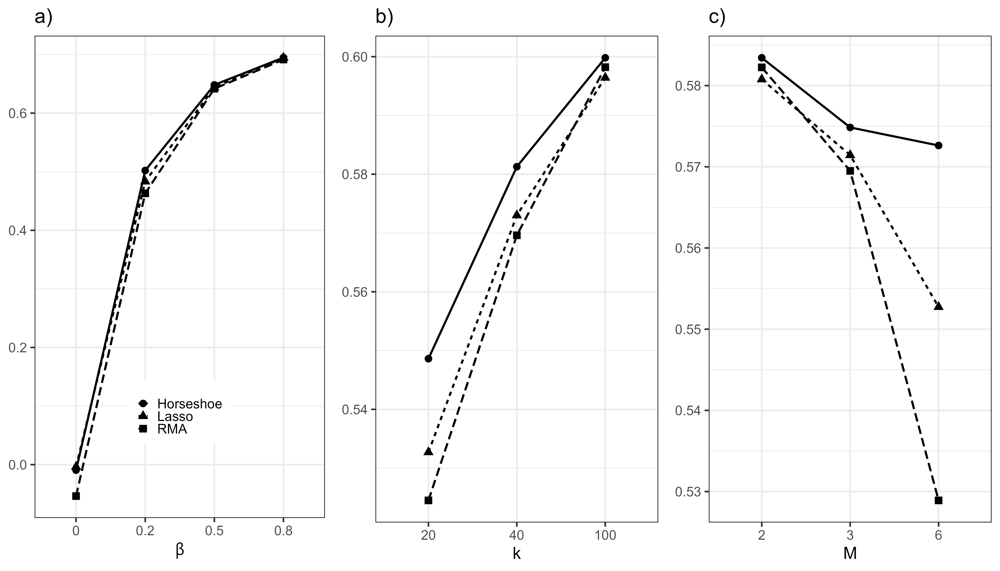

```{r setup, include = FALSE}
library("papaja")
library(tidySEM)
library(kableExtra)
r_refs("r-references.bib")
out <- readRDS("output.RData")
```

```{r analysis-preferences}
# Seed for random number generation
set.seed(42)
knitr::opts_chunk$set(cache.extra = knitr::rand_seed)
```

<!--
Skeleton lasso/pema paper
1.) What is Meta-analysis?
2.) What is meta-regression and how does it complement meta-analysis?
	a.) Introduce Moderators
	b.) Study Heterogeneity + Random Sampling Error (and their difference)	
2.5.) Fixed vs. random effects
	a.) Shortcomings of fixed effect models
3.) Shortcomings of current meta regressions w.r.t. estimating coefficients and heterogeneity:
	a.) Small sample size / overfitting
	b.) Non-normal data
4.) Various methods to estimate heterogeneity (and coefficients)
	a.) The use of WLS and REML
5.) Intro to Frequentist linear methods/Bayesian methods and Random forests, along with their 
(dis-)advantages:
	a.) Rma: uses WLS for estimation
	b.) MetaForest (Random Effects): Uses Random Forest Algorithm
	c.) Lasso Pema: uses penalized Lasso
	d.) Horseshoe Pema: uses horseshoe priors
6.) Goal of the current study
7.) Means of attaining goal and evaluation of performance:
	a.) simulation study
	b.) algorithmic performance
	c.) design factors
	d.) Impact of design factors on algorithim performance
	e.) Hypotheses of algorithmic performances

colour coding: I colour coded the text as to know from which file the text is copied
GREEN = derived from ‘Thesis_Metaforest’
BLUE = Thesis_lasso
BLACK = internship_report
RED = Inserted myself

# Introduction
--> 

Meta-analysis is a quantitative form of evidence synthesis,
whereby effect sizes from multiple similar studies are aggregated.
In its simplest form, this aggregation consists of the computation of a summary effect as a weighted average of the observed effect sizes.
This average is weighted to account for the fact that some observed effect sizes are assumed to be more informative about the underlying population effect.
Each effect size is assigned a weight that determines how influential it is in calculating the summary effect.
This weight is based on specific assumptions;
for example, the *fixed effect* model assumes that all observed effect sizes reflect one underlying true population effect size.
This assumption is well-suited to the situation where effect sizes from close replication studies are meta-analyzed [@higginsReevaluationRandomeffectsMetaanalysis2009, fabrigar_conceptualizing_2016, maxwell_is_2015]. 
The *random effects* model, by contrast, assumes that population effect sizes follow a normal distribution.
Each observed effect size provides information about the mean and standard deviation of this distribution of population effect sizes.
This assumption is more appropriate when studies are conceptually similar and differences between them are random [@higginsReevaluationRandomeffectsMetaanalysis2009, fabrigar_conceptualizing_2016, maxwell_is_2015]. 

Not all heterogeneity in effect sizes is random, however.
Quantifiable between-study differences may introduce systematic heterogeneity.
Such between-study differences are known as "moderators".
For example, if studies have been replicated in Europe and the Americas, this difference can be captured by a binary moderator called "continent".
Alternatively, if studies have used different dosages of the same drug, this may be captured by a continuous moderator called "dosage".
Systematic heterogeneity in the observed effect sizes can be accounted for using *meta-regression* (Viechtbauer \& López-López, 2015).
This technique provides estimates of the effect of one or more study characteristics on the overall effect size,
as well as of the overall effect size and residual heterogeneity after controlling for their influence.

One common application of meta-analysis is to summarize existing bodies of literature.
In such situations, the number of moderators is often relatively high because similar research questions have been studied in different laboratories,
using different methods, instruments, and samples.
Each of these between-study differences could be coded as a moderator, and some of these moderators may explain systematic heterogeneity.

It is theoretically possible to account for the influence of multiple moderators using meta-regression.
However, like any regression-based approach, meta-regression requires a relatively high number of cases (studies) per parameter to obtain sufficient power to examine heterogeneity.
In practice the number of available studies is often too low to examine heterogeneity reliably (Riley, Higgins, & Deeks, 2011).
At the same time, there are many potential sources of heterogeneity,
as similar research questions are studied in different laboratories, using different methods,
instruments, and samples.
This leads to a problem known as the "curse of dimensionality": the number of candidate moderators is large relative to the number of cases in the data.
Such cases do not fit comfortably into the
classic meta-analysis paradigm, which, like any regression-based approach, requires a
high number of cases per parameter. 
Between-studies differences thus present a non-trivial challenge to data aggregation
using classic meta-analytic methods.
At the same time, it also offers an unexploited
opportunity to learn which differences between studies have an impact on the effect size
found, if adequate exploratory techniques can be developed. 

Addressing the curse of dimensionality necessitates *variable selection*:
the selection of a smaller subset of relevant moderators from a larger number of candidate moderators.
One way to perform variable selection is by relying on theory.
However, in many fields of science, theories exist at the individual level of analysis (e.g., in social science, at the level of individual people).
These theories do not necessarily generalize to the study level of analysis.
Using theories at the individual level for moderator selection at the study level amounts to committing the ecological fallacy: generalizing inferences across levels of analysis [@jargowskyEcologicalFallacy2004].
To illustrate what a theory at the study level of analysis might look like, 
consider the so-called *decline effect*.
It is a phenomenon whereby effect sizes in a particular tranche of the literature seem to diminish over time [@schoolerUnpublishedResultsHide2011].
It has been theorized that the decline effect can be attributed to regression to the mean:
A finding initially draws attention from the research community because an anomalously large effect size has been published, and subsequent replications find smaller effect sizes.
Based on the decline effect, we might thus expect the variable "year of publication" to be a relevant moderator of study effect sizes.
Note that this prediction is valid even if year is orthogonal to the outcome of interest within each study.
Until more theory about the drivers of between-study heterogeneity is developed,
however, this approach will have limited utility for variable selection.
<!--A second example that might illustrate this problem is a study that concluded that American college students' empathy had decreased over time, based on meta-analysis of 72 samples collected between 1979 and 2009.-->

An alternative solution is to rely on statistical methods for variable selection.
This is a focal issue in the discipline of machine learning [@hastieElementsStatisticalLearning2009].
One technique that facilitates variable selection is *regularization*:
shrinking model parameters towards zero, such that only larger parameters remain.
Although this technique biases the parameter estimates,
it also reduces their variance, which has the advantage of producing more generalizable results that make better predictions for new data [see @hastieElementsStatisticalLearning2009].
This paper introduces *Bayesian regularized meta-regression* (BRMA),
an algorithm that uses Bayesian estimation with regularizing priors to perform variable selection in meta-analysis.
The algorithm is implemented in the function `brma()` in the R-package `pema`.
<!--
Thus, there is a need of a regularization method to curtail overfitting. Least Absolute Shrinkage and Selection Operator [LASSO] (L1-norm regularization) can fulfill this role, since it has an advantage in terms of feature selection. The goal of this project is to implement L1-norm regularization in the weighted meta-regression, developing an new estimator for regularized meta-regression.
This dilemma could be resolved by an exploratory technique that can identify relevant moderators in meta-analysis,
and which is relatively robust to small sample sizes.
-->
<!--Such shrinkage is advantageous because it performs variable selection and results in a sparse model.
Sparse models are easier to interpret, as fewer non-zero effects remain.
Regularization also provides a solution to the curse of dimensionality; unlike standard regression models, it can provide identified models even if the number of moderators exceeds the number of cases.-->
<!--By doing this it automatically performs variable selection. It does not seem to be immediately clear why shrinking the coefficients should be an improvement to the model. However, by shrinking the parameters, it lowers the variance of the model by increasing the bias only a little bit. In other words, the model sacrifices some of its ability to fit the current data, to greatly increase the ability to predict future data with the same fit (James et al., 2013). This is better known as the bias/variance tradeoff (Briscoe & Feldman, 2011).-->

## Statistical underpinnings

To understand how BRMA estimates the relevant parameters and performs variable selection, it is instructional to first review the statistical underpinnings of the aforementioned classic approaches to meta-analysis.
First is the fixed-effect model, which assumes that each observed effect size $T_i$ is an estimate of an underlying true effect size $\Theta$ [@hedgesFixedRandomeffectsModels1998].
The only cause of heterogeneity in observed effect sizes is presumed to be effect size-specific sampling variance, $v_i$, which is treated as known, and computed as the square of the standard error of the effect size.
Thus, for a collection of $k$ studies, the observed effects sizes of individual studies $i$ (for $i$ = 1,2, . . . $k$) are given by:

\begin{align}
T_i &= \Theta + \epsilon_i\\
\text{where } \epsilon_i &\sim N(0, v_i)
\end{align}

<!--
\begin{aligned}
y_i &= \theta_i + \epsilon_i &\text{where } \epsilon_i \sim N(0, \sigma^2_i)\\ % \text{ and } 
%\theta_1 &= \theta_2 \dots = \theta_k
\end{aligned}-->

Under the fixed effect model, the estimated population effect size  $\hat{\theta}$ is obtained by computing a weighted average of the observed effect sizes.
If sampling error is assumed to be the only source of variance in the observed effect size,
then it follows that studies with smaller standard errors estimate the underlying true effect size more precisely<!--(Schmidt, Oh \& Hayes, 2009)-->.
The fixed-effect weights are thus simply the reciprocal of the sampling variance, $w_{i} =  \frac{1}{v_i}$.
The estimate of the true effect is a weighted average across observed effect sizes:

\begin{equation}
\hat{\theta} = \frac{\sum_{i=1}^k w_iT_i}{\sum_{i=1}^k w_i}
\end{equation}
-->
<!--A highly likely consequence is that this will lead to a huge amount of possible moderators (Caserio, 2014). Caused by differences in for example cultures of research populations and used methods or instruments (Neuman, 2011). Even in replication studies there are sometimes moderators that are unanticipated (Kunert, 2016). This leads very often to an eventual poor performance of the fixed-effects meta-analysis model (Snijders, 2005). -->
	
Whereas the fixed-effect model assumes that only one true population effect exists,
the random-effects model assumes that true effects may vary for unknown reasons,
and thus follow a (normal) distribution of their own (Hedges \& Vevea, 1998).
This heterogeneity of the true effects is represented by their variance, $\tau^{2}$.
The random effect model thus assumes that the heterogeneity in observed effects can be decomposed into sampling error and between-studies heterogeneity, resulting in the following equation for the observed effect sizes:

\begin{align}
T_i &= \Theta + \zeta_{i} + \epsilon_i\\
\text{where } \zeta_i &\sim N(0, \tau^2)\\
\text{and } \epsilon_i &\sim N(0, v_i)
\end{align}

In this model, $\Theta$ is the mean of the distribution of true effect sizes, and $\tau^2$ is its variance, which can be interpreted as the variance between studies.

If the true effect sizes follow a distribution, 
then even less precise studies (with larger sampling errors) may provide some information about this distribution.
Like fixed-effect weights, random effects weights are still influenced by sampling error, but this influence is attenuated by the estimated variance of the true effect sizes. 
The random-effects weights are thus given by $w_{i} =  \frac{1}{v_i + \hat{\tau}^2}$.
It is important to note that,
whereas the sampling error for each individual effect size is treated as known, the
between-study heterogeneity $\tau^{2}$ must be estimated.
This estimate is represented by $\hat{\tau}^{2}$.

### Meta-regression

The random-effects model assumes that causes of heterogeneity in the true effect sizes are unknown, and that their influence is random.
Oftentimes, however, there are systematic sources of heterogeneity in true effect sizes.
These between-study differences can be coded as moderators, and their influence can be estimated and controlled for using meta-regression.
Meta-regression with $p$ moderators can be expressed with the following equation, where $x_{1\ldots p}$ represent the moderators, and $\beta_{1\ldots p}$ the regression coefficients:

\begin{align}
T_i &= \beta_{0}+ \beta_{1}x_{1}+ \beta_{2}x_{2} + \ldots + \beta_{p}x_{p} + \zeta_{i} + \epsilon_i\\
\end{align}

Note that $\beta_0$ represents the intercept of the distribution of true effect sizes after controlling for the moderators
and the error term $\zeta_{i}$ represents residual between-studies heterogeneity.
This term is still included because unexplained heterogeneity often remains after accounting for the moderators (Thompson \& Sharp, 1999).
This is a mixed-effects model; the intercept and effects of moderators are treated as fixed and the residual heterogeneity as random (Viechtbauer \& López-López, 2015).

<!--
An accurate estimation of the residual heterogeneity contributes to a better interpretation of the effect of the moderators (Panityakul, Bumrungsup \& Knapp, 2013).-->

To solve this model, the regression coefficients and residual heterogeneity must be estimated simultaneously.
<!--The topic of estimating the residual heterogeneity is a highly discussed one (Veroniki et al., 2016; Viechtbauer \& López-López, 2015; Panityakul et al., 2013). The ability of the estimators to predict the residual heterogeneity is influenced by different factors, such as the number of studies (Guolo \& Varin, 2017; Panityakul et al., 2013; Hardy \& Thompson, 1996) included and the sample size of the individual studies (Panityakul et al., 2013).
A third, and obvious factor, that is classified as relevant to model performance is heterogeneity among studies being meta-analysed (Kontopantelis \& Reeves, 2011; Jackson \& White, 2018). Coverage from models degrades when the residual heterogeneity increases, mostly when the amount of studies is small (Brockwell \& Gorden, 2001). Considering that all models their performance is linked to the accuracy of the estimate. According to Sidik \& Jonkman (2007), it is generally the case that the larger true between-study variance is, the more biased the estimate can be, which diminishes the performance of the method.-->
Numerous methods have been proposed to estimate meta-regression models, the most commonly used of which is restricted maximum likelihood (REML).
REML is an iterative method, meaning it performs the same calculations repeatedly, updating the estimated regression coefficients and residual heterogeneity until these estimates stabilize.
<!--, including the Hedges (HE), DerSimonian–Laird/Method of Moments (DL), Sidik and Jonkman (SJ), Maximum Likelihood (ML), Restricted Maximum Likelihood (REML), and Empirical Bayes (EB) method. These methods are mostly divided into two groups: closed-form or non-iterative methods and iterative methods. The main difference between these groups is that the closed form group uses a predetermined number of steps to provide an estimation for the residual heterogeneity, whereas the iterative methods run multiple iteration, as the name suggests, to converge to a solution when a specific criterion is met. It is important to note that some iterative methods do not produce a solution when they fail to converge after a predetermined amount of iteration.-->
This estimator has low bias, which means that the average value of the estimated regression coefficients and residual heterogeneity is close to their true values (Panityakul et al., 2013; Hardy & Thompson, 1996).
However, this bias comes at the cost of higher variance, which means that the estimated values of a population parameter vary more from one sample to the next. 
In practice, an estimator with higher variance generalizes less well to new data.
This phenomenon is known as the *bias-variance tradeoff*.
Regularization increases bias to reduce variance, and thus produces more generalizable estimates.
<!--It needs a starting estimation of $\tau^{2}$, which is usually estimated by one of the non-iterative methods (Viechtbauer \& López-López, 2015). Besides the starting value of $\tau^{2}$, it needs in every iteration an estimation of the regression coefficients of the moderators. These are typically estimated by using the Weighted Least Squares (WLS) method. This is a variation of the Ordinary Least Squares (OLS), but in the case of meta-analysis it is necessary to assess weights to the coefficients. In systematic reviews large variation in standard errors is often observed, which will result in large heteroscedasticity in the estimation of the effects (Stanley \& Doucouliagos, 2017). The addition of weights is a way to adjust for this heteroscedasticity. The weights are formulated as presented in equation (5).-->
<!--
The usage of a WLS method to estimate the regression coefficient may be problematic in the situation where a lot of moderators are measured without their specific effects, when the amount of studies is low and when moderators are dichotomous. The use of a least squares method will cause problems with the prediction accuracy and the model interpretability (James, Witten, Hastie, \& Tibshirani, 2013). In the situation where a lot of moderators are measured and blindly included in the model, it may as well be the case that variables are included that are in fact not associated with the response. Including irrelevant variables in the model lowers the interpretability of the model (James et al., 2013). An approach is necessary that automatically excludes the variables that are irrelevant i.e. performs variable selection. As explained before, in meta-analysis it is often the case that the number of moderators closely approaches or even exceeds the number of studies included in the analysis. A least squares method will display a lot variability in the fit when the number of variables is not much smaller than the number of studies (James et al., 2013). This means that the least squares method over fits the data and loses its power to be generalizable to future observations. When the number of variables exceeds the number of studies, the least squares method fails to produce one unique estimate and the method should not be used at all. 

However, a least squares method could still be somewhat valuable in some situations. It is extremely suitable to estimate a linear relationship. In the case of dichotomous moderators, the relationship is always perfectly linear. A powerful non-linear estimation tool is in the situation of dichotomous moderators unnecessary and would not perform better at all. Whenever a non-linear relation gets fitted on data with an underlying linear relation, it will cause problems when this fit gets used for the prediction of future data. Given the various arguments, this paper provides an approach to tackle this problem of the least squares methods whilst still making use of a linear method. The weighted least squares are replaced with the so-called LASSO regression for the estimation of the regression coefficients. This algorithm shrinks or penalizes the regression coefficients and performs variable selection (James et al., 2013; Hesterberg, Choi, Meier, \& Fraley, 2008).-->

### Regularized regression

Regularized regression biases parameter estimates towards zero by including a shrinkage penalty in the estimation process.
Before examining the Bayesian case, we will explain the principle using frequentist OLS regression as an example.
OLS regression estimates the model parameters by minimizing the Residual Sum of Squares (RSS) of the dependent variable, which is given by:

$$
RSS=\sum_{i=1}^{n}(y_{i} - \beta_{0} - \sum_{j=1}^{p}\beta_{j}x_{ij})^2
$$
The resulting parameter estimates are those that give the best predictions of the dependent variable in the present dataset.
Penalized regression, by contrast, adds a penalty term to the RSS.
One commonly used penalty is the L1-norm of the regression coefficients, or LASSO penalty ([@hastieElementsStatisticalLearning2009]),
which corresponds to the sum of their absolute values.
This gives the penalized residual sum of squares:

$$
PRSS= RSS + \lambda \sum_{j=1}^{p}|\beta_{j}|
$$

Because the penalty term is a function of the regression coefficients,
the optimizer is incentivized to keep the regression coefficients as small as possible.
In this equation, $\lambda$ is a tuning parameter that determines how influential the penalty term will be.
If $\lambda$ is zero, the shrinkage penalty has no impact at all and the penalized regression will produce the OLS estimates.
If $\lambda \to \infty$, all coefficients shrink towards zero, producing the null model.
<!--Another commonly used penalty is the L2-norm of the coefficients, or ridge penalty,
which corresponds to the sum of their squared values: $\sum_{j=1}^{p}\beta_{j}^2$.-->
Generally, cross-validation is used to find the optimal value for the penalty parameter $\lambda$.
<!--The LASSO penalty has the unique property of shrinking some coefficients to be exactly zero,
but the ridge penalty does not do so, as -->
Note that the LASSO penalty is but one example of a shrinkage penalty; other penalties exist.

<!--The Lasso shrinkage method is not the only shrinkage method, there do exist some others. Nevertheless, the lasso is in the case the best option. It possesses, as opposed to other methods, the ability to shrink the parameter not towards zero, but to be exactly zero (James et al., 2013; Hesterberg, Choi, Meier, \& Fraley, 2008). This means that the lasso can perform variable selection, something that is specifically aimed for in this study. -->


<!--
**Alternative to linear model: Tree Based models**
An alternative that can perform variable selection, are tree-based models. These kinds of models have numerous other advantages over linear models. Tree-based models can be used for any data type, are easy to represent visually, require little data preparation and got larger power than linear regressions when moderators exceed observations in quantity. They are also more flexible in handling moderator interactions and non-linearity. As a result of that, they are better in modelling the complicated nature of human behaviour (Earp \& Trafimow, 2015). Decision trees split from the top down and group data in so-called ‘sub-nodes’, in which the data’s aspects are most homogeneous. The goal is to split to get the sub-nodes as uniform as possible, which can be until fully homogenous groups, or if a pre-specified touchstone is reached. 
Still, singletree based models have some limitations. First of all, tree models are unstable, small fluctuations that are utilized to make the model have a possibility to lead to considerable alterations in the constructions of the tree (Dwyer \& Holte, 2007). Second, it has problems with seizing linearity, because it only makes ‘twofold splits’ (Steyerberg, 2019). At last, tree-based models are susceptible to overfitting (Hastie et al, 2009). 

There are also more complex tree-based models, known as random-forests, which surmount most of the disadvantages of singletree. This variant incorporates multiple decision trees, and combines results from those trees to create a single model with a more accurate estimate (Breiman, 2001). The essential idea behind is know as the ‘wisdom of crowds’, a large number of relatively uncorrelated trees operating as a group will outperform any of the individual elements. The somewhat low correlation between the models is fundamental, because uncorrelated models are able to produce ensemble predictions with a higher accuracy that any individual prediction. This is because the trees preserve each other from their own singular errors (Genuer, Poggi \& Tuleau-Malot, 2010). The lower tendency to overfitting is another advantage of random forests over single trees (Bühlmann \& Yu, 2002). As well as the possibility to predict cases that are not components of the bootstrap sample of the tree. This kind of measure is known as out-of-bag error, which is an approximation of the cross-validation error, and provides proper estimates of the prediction accuracy in further samples (Hastie et al., 2009). 
An alternative to explore heterogeneity in meta-analysis with a singletree-based method is MetaForest. A technique developed by van Lissa (2017), designed to overcome the lacking’s of singletrees by using random forests. MetaForest applies random-effects or fixed-effects weights to random forests.
Based on two simulation studies, van Lissa (2017) examined the performance of fixed-effects, random-effects and unweighted MetaForest.

The study displayed also other advantages from random forests over singletrees. It had greater power, was able to make better predictions, gave estimates of the cross-validation error and yielded useful measures of variable importance and partial prediction plots (van Lissa, 2017). MetaForest can at the moment be considered as the best working technique to explore heterogeneity in meta-analysis. In van Lissa (2017), that only presented estimates of $\tau^{2}$ based on the raw data, we saw that MetaForest had certain robustness against a low number of studies. If moderators were continuously distributed, MetaForest had sufficient power at approximately 20 studies. However, there is an important feature to prove before we can make such an assumption. The underlying data generating models in the two simulation studies of van Lissa (2017) only included normal distributed moderators. Renouncing from normal distributions may affect the performance of the model, but since normal distribution in real-life data is more an exception than a normal state of affairs (Micceri, 1989), it is entirely possible that procedures are affected by skewness, leverage, balance etc. It is important to know how MetaForest performs in these kinds of situations.-->

### Standardizing predictors

<!-- Eli? -->
<!-- * Eli, kan jij het algemene principe van standardization hier uitleggen, met een paar referenties?
In de volgende paragraaf over intercepts moet ook nog een referentie, over wel/niet standaardizeren van dummies.-->
<!-- * In BRMA werk het als volgt: -->
<!--     + By default, all variables are normalized. -->
<!--     + The penalized model (without an intercept) is estimated on the normalized data -->
<!--     + The intercept is then restored to the original scale by applying  -->
<!--     $b_0 = b_{0z} - \mathbf{b}_z\frac{\bar{\mathbf{x}}}{\mathbf{s}_x}$ -->
<!--     Where b_0 is the intercept, b_0z is the intercept for the normalized predictors, b_z is the vector of     regression coefficients for the normalized predictors, bar x is the vector of means of X, and s_x is the vector of standard deviations of x -->
<!--     + The regression coefficients are restored to the original scale by applying  -->
<!--     $\mathbf{b} = \mathbf{b}_z\mathbf{s}_x$ -->
<!-- * Leg vervolgens uit dat mensen dummies misschien niet willen standaardizeren -->
<!-- * Gebruikers kunnen de default standaardization overschrijven door een aantal van de variabelen handmatig te standaardizeren, en de vector met means en vector met SDs handmatig mee te geven via het argument `standardize = list(center = meanvec, scale = sdvec)`. Als ze een bepaalde variabele NIET willen standaardizeren moeten ze voor die variabele mean= 0 en sd= 1 meegeven. -->

Penalized regression analyses typically require the scales of predictors to be equivalent ([@tibshirani1996]).
This is because the regularization penalizes coefficients without regard for their scale.
If variable scales differ, this can lead to an imbalanced penalization of coefficients that does not reflect differences in variable importance ([@lee2015note]).
To clarify, a regression parameter $\beta$ can be interpreted as the expected increase in outcome $\mathbf{Y}$ for a one unit increase in predictor $\mathbf{X}$.
If the scale of predictor $\mathbf{X}$ is increased by a factor 10, its regression coefficient is reduced by a factor 10.
Standardization is a widely used method for equalizing predictor scales ([@gelman2008scaling]).
It sets the mean of all predictors to 0 and their standard deviation to 1 by Z-transforming all predictors as follows:

$$
\mathbf{Z} = \frac{\mathbf{X}- \bar{\mathbf{X}}}{\mathbf{s_X}}
$$
where $\bar{\mathbf{X}}$ is a vector of predictor means and $\mathbf{s_X}$ is a vector of standard deviations of the predictors.
By default, `brma()` standardizes the predictors on which the model is estimated.
The function returns the estimated parameters back to their original scales.
This is achieved for the intercept by applying:

$$
b_0 = b_{0Z} - \mathbf{b}_Z\frac{\bar{\mathbf{X}}}{\mathbf{s}_X} \\
$$
where $b_0$ is the intercept, $b_{0Z}$ is the intercept for the standardized predictors and $\mathbf{b_Z}$ is the vector of regression coefficients for the standardized predictors.
The regression coefficients are returned to their original scale by applying:

$$
\mathbf{b_X} = \frac{\mathbf{b_Z}}{\mathbf{s_X}}
$$

It is not always necessary or desirable to standardize predictors, however.
For example, if predictors are already standardized or on a unified scale for different reasons.
In these cases standardization does not make scales more equal, nor the penalization more fair, and the default standardization in `brma()` can be disabled.
<!--Alternatively, if the goal of a study is to compare results to prior findings based on unstandardized predictors, standardization would make penalization unequal across studies.-->

There are additional considerations regarding standardization of binary and dummy predictors ([@alkharusi2012categorical]).
Some suggest to always standardize binary predictors ([@tibshirani1997lasso]).
This makes that, irrespective of initial scaling, the binary predictor will be on the same scale as the continuous standardized predictors ([@gelman2008scaling]).
However, standardizing binary predictors may decrease model interpretability ([@wissmann2007role]).
To illustrate this point, consider bivariate regression with a single binary predictor $X$ that takes on values 0 and 1 predicting outcome $Y$.
The intercept represents the expected value of $Y$ when $X == 0$, and the regression coefficient represents the difference in the expected value of $Y$ between the two conditions ([@alkharusi2012categorical]).
By standardizing this binary predictor, the reference value is no longer zero, and both the intercept and its regression coefficient have no clear interpretation anymore, especially in multivariate cases ([@wissmann2007role]). 

Multiple coding schemes for categorical predictors exist that are equivalent in OLS regression.
In penalized regression, however, the choice of coding does affect model fit and interpretation ([@chiquet2016coding; @detmer2020note]). Although this paper does not cover such considerations, a more elaborate discussion on how coding schemes affect model accuracy and interpretability in penalized regression can be found in @chiquet2016coding and @detmer2020note.

In `brma()`, the default is to use dummy coding for categorical predictors and standardize the dummies.
Users may specify alternative solutions, keeping in mind the aforementioned considerations. 

There are two ways to circumvent the default standardization in `brma()`.
The first is to disable standardization entirely, analyzing predictors in their original scale,
by setting `standardize = FALSE`.
Alternatively, `brma()` allows custom standardization.
To use this option, first manually standardize (some of) the predictors.
Then, when calling `brma()`, pass a vector of means and a vector of standard deviations to restore the coefficients to the predictors' original scale.
This can be accomplished using the argument `standardize = list(center = meanvector, scale = sdvector)`.
For predictors that **should not** be standardized, a mean of 0 and a standard deviation of 1 must be passed; this will leave the coefficient in question unaffected.

### Intercepts

The standard linear model estimates an intercept, which reflects the expected value of the outcome when all predictors are equal to zero, and regression coefficients for the effect of moderators.
In some cases, it may be desirable to omit the intercept.
For example, if an analysis contains categorical predictors,
these can be encoded as dummy variables, with values $x \in \{0, 1\}$.
For a variable with $c$ categories, the number of dummy variables must be equal to $c-1$;
the omitted category functions as a reference category, and its expected value is represented by the model intercept $b_0$.
This so-called *regression specification* of a model may be useful when there is a meaningful reference category.
For example, imagine a study on the effectiveness of interventions for specific phobia with two types of interventions: An industry-standard intervention, and a more recently developed one.
In this case, it might make sense to code the industry standard intervention as the reference category,
and dummy-code the new contender.
The model will then estimate whether the new contended has an effect size significantly lower or higher than the industry standard.
In other cases, there may not be a straightforward reference category.
For example, imagine a study on the effectiveness of one intervention for specific phobia in two continents.
In such cases, the average effect in both continents may be estimated by omitting the intercept, and including all $c$ dummy variables.
This so-called *ANOVA specification* of a model estimates a mean for all dummy-coded categories.
In BRMA, as in other R functions, one can use ANOVA specification by explicitly removing the intercept from the model formula; for example, if `yi` is the effect size and $C$ a categorical moderator, regression specification with $c-1$ dummies is specified as `yi ~ C`, and ANOVA specification with $c$ dummies is specified as `yi ~ -1 + C`.
The appropriate standardization of dummy variables in penalized regression analyses is a topic of ongoing debate.
Suffice it to say that, for greater interpretability, users may want the freedom to leave dummy variables unstandardized.
This is possible in `brma()` by ...

### Bayesian estimation

Instead of using a penalty to shrink regression coefficients towards zero, it is possible to use a Bayesian prior distribution to achieve a similar result. Whereas classical, frequentist estimation methods rely solely on the data at hand, Bayesian estimation methods require the specification of a prior distribution. The prior distribution is a probability distribution that reflects the prior knowledge or beliefs that the researcher has before collecting the data. The prior is combined with the likelihood of the data to form the posterior distribution. In the context of regularization, the prior distribution is specified such that it reflects the prior belief that not all regression coefficients are substantial enough to be included in the model. 

Many different prior distributions exist that have specific properties that enable them to shrink small regression coefficients towards zero, while keeping substantial coefficients large ([@vanErpOberskiMulder2019]). Some prior distributions have been shown to result in exactly the same solutions as classical, frequentist penalties, such as the LASSO. Specifically, placing independent Laplace (i.e., double exponential) priors on the regression coefficients results in posterior modes that are equal to the lasso estimates ([@ParkCasella2008]). In addition, many prior distributions have been developed and investigated specifically for the purpose of providing good shrinkage properties, meaning that the prior pulls small regression coefficients towards zero, without exerting any influence on substantial regression coefficients. A popular prior in this regard is the horseshoe prior ([@CarvalhoPolsonScott2010]). An advantage of the horseshoe prior compared to the lasso is the fact that it has heavier tails. As a result, it will not shrink and therefore bias substantial coefficients as much as the LASSO prior with its lighter tails. 

### Implementation

Bayesian penalized meta-analysis is implemented in the function `brma()` in the R-package `pema`.
For estimation, it depends on Stan, a probabilistic programming language that uses Hamiltonian Monte Carlo to sample from the posterior distribution ([@StanManual]).
Being written in C++, Stan is computationally efficient, but models must be compiled prior to estimation.
This results in substantial computational overhead.
To avoid this overhead, `pema` uses pre-compiled models corresponding to random-effects and three-level meta-regression, with and without an intercept.
Future updates may bring additional models.
At the time of writing, `brma()` supports two priors: the LASSO and the regularized horseshoe.
The LASSO prior is implemented as follows:
<!-- CJ: Sara, kan jij checken of La de juiste notatie is voor de Laplace prior? -->

$$
\beta_{j} \sim \text{La}(0, \frac{s}{\lambda})
$$
where $s$ is a global scale parameter, and $\lambda$ is an inverse-tuning parameter.
By default in `brma()`, the global scale parameter is set to 1,
and the inverse-tuning parameter is given a $\chi^2$ prior with 1 degree of freedom.
Its value is thus optimized during model estimation.

The implementation of the horseshoe prior is based on the regularized horseshoe proposed by @PiironenVehtari2017b:
<!-- CJ: Sara, Kan jij checken wat de juiste notatie is voor "half-t"? -->

$$
\begin{aligned}
\beta_{j} &\sim N(0, \tilde{\tau}_j^2\lambda) \text{, with } \tilde{\tau}_j^2 = \frac{c^2 \tau_j^2}{c^2 + \lambda^2 \tau_j^2}\\
\lambda &\sim \text{half-t}(\nu_1, 0, \lambda^2_0)\\
\tau_j &\sim \text{half-t}(\nu_2, 0, 1)\\
c^2 &\sim \Gamma^{-1}(\frac{\nu_3}{2}, \frac{\nu_3 s^2}{2})
\end{aligned}
$$
This extension of the horseshoe is more numerically stable in certain cases.
In addition, it allows the user to explicitly include prior information regarding the expected number of relevant moderators by setting the argument par_ratio to the ratio of the expected number of non-zero coefficients to the expected number of zero coefficients. <!-- CJ: Je spreekt hier over het argument par_ratio van de functie in Stan. Maar hier in de tekst verwacht ik uitleg over de formule. Zien we par_ratio terug in die formule?-->
In this formula, $\lambda^2_0$ is a global scale parameter that affects the overall shrinkage of the prior, with smaller values resulting in more shrinkage. The default value in `brma()` is 1. 
The thickness of the tails is controlled by two degrees of freedom parameters, $\nu_1$ and $\nu_2$, which default to 1 in `brma()`.
Increasing these degrees of freedom parameters results in a prior with lighter tails,
which is strictly no longer a horseshoe prior.
However, in certain cases<!-- Sara, wat voor cases?--> these lighter tails can aid model convergence. 
The regularized horseshoe differs from the standard horseshoe in the specification of a finite "slab". This slab ensures at least some regularization of large coefficients and as a consequence,
more stable results.
This slab is governed by a degrees of freedom parameter ($\nu_3$, set to 4) and a scale parameter ($s$, set to 1). <!--Sara, eigenlijk is het niet helemaal duidelijk wat al deze nummers doen. Kunnen we een interactieve plot maken waarmee gebruikers kunnen zien hoe aanpassingen de vorm van de prior beinvloeden?-->

Default settings for these hyperparameters in `brma()` were chosen such that the values are reasonable in most applications.
However, in a Bayesian analysis it is good practice to perform a prior sensitivity analysis in which different hyperparameters are chosen and the model is rerun to see if this leads to different results. 
This is particularly important when the sample is small, as the prior is more influential in this case.

Unlike the frequentist LASSO algorithm, Bayesian regularized estimation cannot set coefficients to be exactly equal to zero.
Therefore, variables must be selected post-estimation.
One way to do so is by the use of probability intervals, the Bayesian counterpart of confidence intervals, with a moderator being selected if, for example, a 95% interval excludes zero.
The present study considers two types of intervals:
The credible interval, which is obtained by taking the 2.5% and 97.5% quantiles of the samples of the posterior, and the highest posterior density interval, which is the narrowest possible interval that contains 95% of the probability mass.

<!--To solve this model, the moderator coefficients and the residual heterogeneity must be estimated simulataneously.
<!--The topic of estimating the residual heterogeneity is a highly discussed one (Veroniki et al., 2016; Viechtbauer \& López-López, 2015; Panityakul et al., 2013). The ability of the estimators to predict the residual heterogeneity is influenced by different factors, such as the number of studies (Guolo \& Varin, 2017; Panityakul et al., 2013; Hardy \& Thompson, 1996) included and the sample size of the individual studies (Panityakul et al., 2013).
A third, and obvious factor, that is classified as relevant to model performance is heterogeneity among studies being meta-analysed (Kontopantelis \& Reeves, 2011; Jackson \& White, 2018). Coverage from models degrades when the residual heterogeneity increases, mostly when the amount of studies is small (Brockwell \& Gorden, 2001). Considering that all models their performance is linked to the accuracy of the estimate. According to Sidik \& Jonkman (2007), it is generally the case that the larger true between-study variance is, the more biased the estimate can be, which diminishes the performance of the method.-->
<!--Numerous methods have been proposed to accurately estimate the residual heterogeneity, including the Hedges (HE), DerSimonian–Laird/Method of Moments (DL), Sidik and Jonkman (SJ), Maximum Likelihood (ML), Restricted Maximum Likelihood (REML), and Empirical Bayes (EB) method. These methods are mostly divided into two groups: closed-form or non-iterative methods and iterative methods. The main difference between these groups is that the closed form group uses a predetermined number of steps to provide an estimation for the residual heterogeneity, whereas the iterative methods run multiple iteration, as the name suggests, to converge to a solution when a specific criterion is met. It is important to note that some iterative methods do not produce a solution when they fail to converge after a predetermined amount of iteration. 

In our scenario we are especially interested in an estimator which performs well under the condition of a relative low number of studies. The Restricted Maximum Likelihood (REML) seems to produce the lowest bias under this condition and is therefore preferred (Panityakul et al., 2013; Hardy & Thompson, 1996). The REML is an iterative method and needs a starting estimation of $\tau^{2}$ to start, usually it gets estimated by one of the non-iterative methods (Viechtbauer \& López-López, 2015). Besides the starting value of $\tau^{2}$, it needs in every iteration an estimation of the regression coefficients of the moderators. These are typically estimated by using the Weighted Least Squares (WLS) method. This is a variation of the Ordinary Least Squares (OLS), but in the case of meta-analysis it is necessary to assess weights to the coefficients. In systematic reviews large variation in standard errors is often observed, which will result in large heteroscedasticity in the estimation of the effects (Stanley \& Doucouliagos, 2017). The addition of weights is a way to adjust for this heteroscedasticity. The weights are formulated as presented in equation (5). 

The usage of a WLS method to estimate the regression coefficient may be problematic in the situation where a lot of moderators are measured without their specific effects, when the amount of studies is low and when moderators are dichotomous. The use of a least squares method will cause problems with the prediction accuracy and the model interpretability (James, Witten, Hastie, \& Tibshirani, 2013). In the situation where a lot of moderators are measured and blindly included in the model, it may as well be the case that variables are included that are in fact not associated with the response. Including irrelevant variables in the model lowers the interpretability of the model (James et al., 2013). An approach is necessary that automatically excludes the variables that are irrelevant i.e. performs variable selection. As explained before, in meta-analysis it is often the case that the number of moderators closely approaches or even exceeds the number of studies included in the analysis. A least squares method will display a lot variability in the fit when the number of variables is not much smaller than the number of studies (James et al., 2013). This means that the least squares method over fits the data and loses its power to be generalizable to future observations. When the number of variables exceeds the number of studies, the least squares method fails to produce one unique estimate and the method should not be used at all. 

However, a least squares method could still be somewhat valuable in some situations. It is extremely suitable to estimate a linear relationship. In the case of dichotomous moderators, the relationship is always perfectly linear. A powerful non-linear estimation tool is in the situation of dichotomous moderators unnecessary and would not perform better at all. Whenever a non-linear relation gets fitted on data with an underlying linear relation, it will cause problems when this fit gets used for the prediction of future data. Given the various arguments, this paper provides an approach to tackle this problem of the least squares methods whilst still making use of a linear method. The weighted least squares are replaced with the so-called LASSO regression for the estimation of the regression coefficients. This algorithm shrinks or penalizes the regression coefficients and performs variable selection (James et al., 2013; Hesterberg, Choi, Meier, \& Fraley, 2008). -->

<!--
**Intro rma**
The rma algorithm is part of the software-package `metafor` in `R`, which is developed by Wolfgang Viechtbauer (2010, 2019). This algorithm is specifically developed to perform a meta-analysis or meta-regression. It allows to include different models, such as the fixed-, random- and mixed-effect model. It is also possible to account for moderators (Viechtbauer, 2010). The mixed-effect model, which is used is this study, requires a two-step approach to fit a meta-analytic model. First the residual heterogeneity is estimated. The package developed by Viechtbauer does provide multiple methods for the estimation of the residual heterogeneity. In this study the Restricted Maximum-likelihood is used, but this has already been discussed earlier. The second step is estimating the moderator coefficients, which is done by using the Weighted Least Squares (WLS) method. The weights are described in equation (5). The lma is a variation of the rma algorithm which is created by Caspar van Lissa. As explained before, the REML is an iterative procedure for the estimation of the residual heterogeneity. In every step of the process, instead of estimating the coefficients of the moderators by using a WLS, a weighted lasso regression is performed. Then again, the residual heterogeneity gets estimated with the rma algorithm by using the new values of the coefficients. With these new values of $\tau^{2}$, a new weighted lasso is performed for the estimations of the coefficients. This process continuous, until the residual heterogeneity converges to a certain value. -->

# Simulation study

The present study set out to validate the BRMA algorithm using a simulation study.
As a benchmark for comparison, we used restricted maximum likelihood meta-regression,
which is the standard in the field.
We evaluated the algorithms' predictive performance in new data, 
<!-- examining its predictive performance in new data, its sensitivity and specificity in variable selection, and its bias and variance in recovering population parameters. -->
<!-- their ability to perform variable selection, -->
and their ability to recover population parameters. 
Our research questions are whether BRMA offers a performance advantage over RMA in terms of any of these indicators;
under what conditions BRMA does not offer an advantage,
and which prior (regularized horseshoe versus LASSO) is to be preferred.

## Performance indicators

Predictive performance reflects how well the algorithm is able to predict data not used to estimate the model parameters, in other words, it indicates the generalizability of the model.
To compute it, for each iteration of the simulation both a training dataset and a testing dataset are generated.
The model is estimated on the training data, which has a varying number of cases according to the simulation conditions.
Predictive performance is then operationalized as the explained variance in the testing data, $R^2_{test}$.
The testing data has 100 cases in all simulation conditions.
The $R^2_{test}$ reflects the fraction of variance in the testing data explained by the model,
relative to the variance explained by the mean of the training data.
For a predictive performance measure, it is necessary to use the mean of the training data, as the mean of the testing set is a descriptive statistic of that sample. **ik vind deze zin niet heel duidelijk**
The resulting metric $R_{test}^{2}$ is expressed by the following equation:

$$
R_{test}^{2} = 1- \frac{\sum_{i=1}^{k}(y_{i-test}-\hat{y}_{i-test})^{2}}{\sum_{i=1}^{k}(y_{i-test}-\bar{y}_{train})^{2}}
$$

With $k$ being the number of studies in the testing dataset, $\hat{y}_{i-test}$ being the predicted effect size for study $i$, and $\bar{y}_{train}$ being the mean of the training dataset.

The algorithms' ability to perform variable selection was evaluated by sensitivity and specificity.
Sensitivity $P$ is the ability to select true positives, or the probability that a variable is selected, $S = 1$, given that it has a non-zero population effect: $P = p(S = 1||\beta| >0)$.
Specificity is the ability to identify true negatives, or the probability that a variable is not selected given that it has a zero population effect: $N = p(S = 0|\beta  = 0)$.

The ability to recover population parameters $\beta$ and $\tau^2$ was examined in terms of bias and variance of these estimates.
The bias is given by the mean deviation of the estimate from the population value,
and the variance is given by the variance of this deviation.

## Design factors

To examine performance in a range of realistic meta-analysis scenarios,
several design factors were manipulated:
The number of studies in the training data $k \in (20, 40, 100)$, the average within-study sample size $\bar{n} \in (40, 80, 160)$, the population effect size of relevant moderators $\beta \in (0, .2, .5, .8)$, the number of moderators $p \in (2, 3, 6)$, and residual heterogeneity $\tau^{2} \in (.01, .04, .1)$. **het aantal moderatoren is redelijk laag; ik zou vooral nog voordelen van brma verwachten met meer moderatoren maar is dat realistisch in de praktijk? Zo ja, dan is het iets om te noemen in de discussie**
According to a review of 705 published psychological meta-analyses (Van Erp et al., 2017),
these values of $\tau^2$ fall within the range observed in practice.
Note that both BRMA and RMA assume linear effects.
To test the robustness of the algorithms to violations of this assumption, true effect sizes were simulated using two models:
one with a linear effect of one moderator, $T_{i}= \beta x_{1i} + \epsilon_i$, and one with a non-linear (cubic) effect of one moderator, $T_{i}= \beta x_{1i} + \beta x_{1i}^{2} + \beta x_{1i}^{3} + \epsilon_i$,
where $\epsilon_i \sim N(0, \tau^2)$.
The algorithms further assume normality of residuals.
To examine robustness of the algorithms to violations of this assumption,
moderator variables were simulated as skewed normal moderators, with scale parameter $\omega \in (0, 2, 10)$, where $\omega = 0$ corresponds to the standard normal distribution.
The design factors combined to produce `r out$conditions` unique conditions.
For all simulation conditions, 100 data sets were generated. 
In each data set, the observed effect size $y_i$ was simulated as a standardized mean difference (SMD),
sampled from a non-central t-distribution.

<!-- x = rnorm(1000) -->
<!-- func <- function(x, b){b*x+(b*(x^2))+(b*(x^3))} -->
<!-- dat <- data.frame(x = x, -->
<!--                   y = c(func(x, .2), func(x, .5), func(x, .8)), -->
<!--                   es = rep(c(".2", ".5", ".8"), each = 1000)) -->
<!-- ggplot(dat, aes(x, y, color = es))+geom_smooth() -->

# Results

Any iterative algorithm is susceptible to convergence problems.
In such cases, the BRMA algorithms provide warning messages,
but still return samples from the posterior.
We were thus able to use all iterations of the BRMA algorithms,
although some of these may have failed to converge and thus have poor performance.
The RMA algorithm failed to converge more regularly, however, in which case the process terminates with an error.
To handle these contingencies, we automated some of the steps recommended [on the `metafor` website](https://www.metafor-project.org/doku.php/tips:convergence_problems_rma).
Despite this, `r out$missing` replications of the RMA algorithm still failed to converge.
All of these were characterized by low number of cases ($k \leq 40$) and high effect sizes $\beta \geq .5$.
These cases were omitted from further analysis.

## Predictive performance
```{r}
out <- readRDS("output.RData")
whichhi <- prop.table(out$which_highest)
```

Within data sets, the BRMA with a horseshoe prior had the highest predictive performance `r round(whichhi[1]*100)`% of the time, followed by RMA, `r round(whichhi[3]*100)`%, and finally BRMA with a LASSO prior, `r round(whichhi[2]*100)`%.
Results indicated that the overall $R^2_{test}$ was highest for BRMA with a horseshoe prior and lowest for RMA, see \@ref(tab:tabr2).
This difference was driven in part by the fact that explained variance was somewhat higher for the BRMA models when the true effect was non-zero (i.e., in the presence of a population effect),
and by the fact that RMA had larger negative explained variance when the true effect was equal to zero (i.e., there was no population effect to detect).

```{r tabr2, results= "asis"}
tab <- read.csv("r2.csv")[1:7][c(1, 2,5,3,6,4,7)]
#[, c(seq(1, 9, by = 3), seq(2, 9, by = 3),
#                                                                  seq(3, 9, by = 3))]
names(tab)[1] <- ""
names(tab) <- gsub(".", " ", names(tab), fixed = T)
names(tab)[grepl("Mean", names(tab))] <- paste0(names(tab)[grepl("Mean", names(tab))], "}$")
names(tab) <- gsub("Mean R2", "$\\bar{R^2}_{", names(tab), fixed = T)
names(tab) <- gsub("SD R2.*", "$SD$", names(tab))
names(tab) <- gsub("CI.*", "$CI_{95}$", names(tab))
kbl(tab[, ], caption = "Mean and SD of predictive R2 for BRMA with a horseshoe (HS) and LASSO prior, and for RMA, for models with a true effect (ES != 0) and without (ES = 0).", digits = 2, row.names = FALSE, escape = FALSE, booktabs = TRUE, col.names = gsub("\\.\\d", "", names(tab)))
  
```

The effect of the design factors on $R^2_{test}$ was evaluated using ANOVAs.
Note that p-values are likely not informative due to the large sample size and violation of the assumptions of normality and homoscedasticity.
The results should therefore be interpreted as descriptive, not inferential, statistics.
Table \@ref(tab:tabr2eta) reports the effect size $\eta^{2}$ of simulation conditions on $R^2_{test}$.
<!-- for main effects and two-way interactions between simulation conditions. -->
<!-- , -->
<!-- we provide an overview of the interpretation of those effects in the Table. -->
<!-- For interaction effects, we report whether the interaction was spreading -->
<!-- Interpretation was less straightforward for a number of interactions; -->
<!-- for these, the median $R^2_{test}$ is graphed in Figure \@ref(fig:figanova). -->

```{r tabr2eta, results= "asis", eval = TRUE}
tabanova <- readRDS("anova.RData")
tabanova <- tabanova[!grepl(":", tabanova$condition), ]
tabanova$Interpretation[!tabanova$Interpretation %in% c("positive", "negative", "other")] <- NA
#tabanova$condition <- gsub("alpha", "omega", tabanova$condition, fixed = T)
#tabanova$condition <- gsub("$mean{n}$", "$n$", tabanova$condition, fixed = T)
tabanova$Factor <- gsub("\\$(omega|beta|tau)", "\\$\\\\\\1", tabanova$Factor)
#tabanova$HS.vs..LASSO <- NULL
tabanova <- tabanova[, c(ncol(tabanova), 2:(ncol(tabanova)-1))]
# kbl(tabanova, caption = "Effect size of design factors and their two-way interactions on R2 the different algorithms, and of the difference between algorithms. The comparison between HS and LASSO was zero in the second decimal for all conditions. Interpretation indicates whether the effect was uniformly positive or negative (for interactions, the effect of the second design factor in the interaction) for all algorithms.", digits = 2, row.names = FALSE, escape = FALSE, booktabs = TRUE, col.names = gsub("(?<!vs)\\.", " ", names(tabanova), perl = TRUE)) |>
#   kable_styling(latex_options = c("scale_down"))
#tabanova <- tabanova[!grepl(":", tabanova$condition, fixed = T), ]
apa_table(tabanova, caption = "Effect size of design factors on predictive R2 of the different algorithms, and of the difference between algorithms. Interpretation indicates whether a main effect was uniformly positive or negative across all algorithms.", digits = 2, escape = FALSE, col.names = gsub("(?<!vs)\\.", " ", names(tabanova), perl = TRUE))#, longtable = TRUE)
# Interpretation for main effects indicates whether the effect was uniformly positive or negative or other, and for interactions, whether it is a spreading or crossover interaction.
```
```{r figr2, fig.cap="Predictive R2 for BRMA with horseshoe (HS) and LASSO prior, and RMA. Plots are sorted by largest performance difference between BRMA and RMA."}
knitr::include_graphics("r2.png")
```

```{r figanova, fig.cap="Predictive R2 for HS (circle, solid line), LASSO(triangle, dotted line) and RMA (square, dashed line) for interactions. One design factor is displayed in different panels, the other on the x-axis.", eval = FALSE}
knitr::include_graphics("other_effects.png")
```

To test our research questions, we computed interactions of algorithm (HS vs. LASSO, HS vs. RMA and LASSO vs. RMA) with the other design factors.
The $\eta^2$ of these differences between algorithms are also displayed in Table \@ref(tab:tabr2eta).
Note that $\eta^2$ for the comparison between HS and LASSO was zero in the second decimal for all conditions; thus, this comparison was omitted from the Table.
The effect of design factors by algorithm is displayed in Figure \@ref(fig:figr2); these plots have been ranked from largest difference between BRMA and RMA to smallest.
Results indicate that the largest differences between algorithms were due to the effect size $\beta$, number of irrelevant moderators $M$, and the number of cases in the training data $k$.
Evidently, predictive performance increased most for the HS algorithm when the effect size increased above zero.
As noted previously, predictive performance of RMA was most negative (negative explained variance) when the effect size was zero.
The HS algorithm furthermore had the consistently highest predictive performance regardless of number of irrelevant moderators or number of cases in the training data, and was relatively less affected by increases in the number of irrelevant moderators (panel b) or in the number of training cases (panel c).
Similarly, the HS algorithm furthermore had the consistently highest predictive performance regardless of number of cases in the training data, and thus also increased less when the number of training cases increased (panel c).
Conversely, RMA had relatively poor predictive performance on average, and was more responsive to increases in the number of training cases and irrelevant moderators. <!--However, differences between the algorithms were generally small. CJ: Niet mee eens; de verschillen zijn misschien klein in termen van de substantieve interpretatie van R2, maar de grootte van dat verschil hangt af van de gebruikte simulatie condities. Je kan dus een groter verschil aantonen als je daarmee gaat spelen, en een situatie opzoekt die ongunstiger is voor RMA. Belangrijker is dat we uberhaupt een consequent voordeel van BRMA over RMA aantonen-->

```{r figmaindif, fig.cap="Predictive R2 for design factors with largest differences in predictive performance across the HS (circle, solid line), LASSO(triangle, dotted line) and RMA (square, dashed line) algorithms.", eval = FALSE}

```

<!-- Results show that the true effect size $\beta$ had the largest marginal effect on $R^{2}$ for all algorithms. -->
<!-- As $\beta$ increased, each algorithm's performance increased as well. -->
<!-- Predictably, the effect of $\beta$ interacted with the model used to simulate data. -->
<!-- Compared to the linear model, $R^{2}_{test}$ for the cubic model showed diminishing increases with $\beta$. -->
<!-- The third largest marginal effect was that of the simulation model. -->
<!-- All algorithms had higher $R^2_{test}$ under the cubic model than under the linear model, which makes sense because $\beta$ had an additional effect through the polynomials of the relevant moderator. -->
<!-- There was an interaction between the model and the amount of skewness of the predictor variable $\omega$: -->
<!-- For all algorithms, the association between skewness and $R^2_{test}$ was negative for the linear model, and positive for the cubic model. -->
<!-- <!-- Figure \@ref(fig:skewness) shows the relationship. --> -->
<!-- The residual heterogeneity $\tau^{2}$ had a negative linear relationship with $R^{2}_{test}$ for all algorithms. -->
<!-- The mean sample size per study $\bar{n}$ also had a moderate effect for all algorithms, indicating that a greater number of participants within studies was positively linearly related with $R^{2}_{test}$. -->
<!-- Similarly, the number of studies in the training data $k$ was positively related with $R^{2}_{test}$. -->

<!-- Finally, the number of moderators did not have a big effect for the Pema algorithms, while for RMA and MetaForest the effect was more noticeable. The relationship is shown in image 7. The relationship is generally negative with more moderators meaning worse performance, although an increase can be observed as the number of moderators increase from 4 to 6 for all algorithms except MetaForest. This increase in performance for MetaForest appears when the number of moderators go from 3 to 4. -->


## Variable selection
```{r}
selprob <- out$selection
colnames(selprob) <- c("HS", "LASSO", "RMA")
truepos <- paste0(sapply(order(selprob[1,], decreasing = TRUE), function(i)paste0("$P_{", colnames(selprob)[i], "}", report(selprob[1,i]), "$")), collapse = ", ")
trueneg <- paste0(sapply(order(selprob[2,], decreasing = TRUE), function(i)paste0("$N_{", colnames(selprob)[i], "}", report(selprob[2,i]), "$")), collapse = ", ")
proboveral <- colMeans(selprob)
proboveral <- paste0(sapply(order(proboveral, decreasing = TRUE), function(i)paste0("$Acc_{", colnames(selprob)[i], "}", report(proboveral[i]), "$")), collapse = ", ")
```

To determine the extent to which the algorithms could perform variable selection correctly, the sensitivity to true positives $P$ and specificity to true negatives $N$ were calculated.
Only simulation conditions with $\beta > 0$ were used, such that the effect of the first moderator was always positive in the population and could be used to calculate $P$,
and the effect of the second moderator was always zero in the population and could be used to calculate $N$.

As the regularized algorithms shrink all coefficients towards zero, it is unsurprising that sensitivity was highest for the un-regularized algorithm RMA, followed by HS and LASSO, `r truepos`.
By contrast, specificity was higher for the regularized algorithms, `r trueneg`.
Overall accuracy reflects the trade off between sensitivity and specificity.
As the baserate of true positives and true negatives is equal in this simulation, overall accuracy is simply given by $Acc = (P+N)/2$.
Results showed that overall accuracy was approximately equal for RMA and HS, and was lower for LASSO, `r proboveral`.

Cramer's V, an effect size for categorical variables, was used to examine the effect of design factors on sensitivity (Table \@ref(tab:tabcramerp), Figure \@ref(fig:figsensitivity)) and specificity (Table \@ref(tab:tabcramern), Figure \@ref(fig:figspecificity)).
We also computed this effect size for the difference between algorithms in the number of true positives by design factor.

```{r tabcramerp, results= "asis", eval = TRUE}
tabselect <- readRDS("selected.RData")
rownames(tabselect) <- NULL
names(tabselect) <- gsub("(?<!vs)\\.", " ", names(tabselect), perl = TRUE)
apa_table(tabselect, caption = "Effect size (Cramer's V) of design factors, and of the difference between algorithms, on sensitivity (P).", digits = 2, escape = FALSE)#, longtable = TRUE)
# Interpretation for main effects indicates whether the effect was uniformly positive or negative or other, and for interactions, whether it is a spreading or crossover interaction.
```
```{r figsensitivity, fig.cap="Sensitivity by design factors for the HS (circle, solid line), LASSO(triangle, dotted line) and RMA (square, dashed line) algorithms."}
knitr::include_graphics("sensitivity.png")
```
```{r tabcramern, results= "asis", eval = TRUE}
tabselectn <- readRDS("notselected.RData")
rownames(tabselectn) <- NULL
names(tabselectn) = gsub("(?<!vs)\\.", " ", names(tabselectn), perl = TRUE)
apa_table(tabselectn, caption = "Effect size (Cramer's V) of design factors, and of the difference between algorithms, on specificity (N).", digits = 2, escape = FALSE)#, longtable = TRUE)
```
```{r figspecificity, fig.cap="Specificity by design factors for the HS (circle, solid line), LASSO(triangle, dotted line) and RMA (square, dashed line) algorithms."}
knitr::include_graphics("specificity.png")
```

Differences in sensitivity between the algorithms were near-zero for HS and LASSO.
The difference between the two BRMA algorithms and RMA were largest for the design factor effect size $\beta$, followed by the model and number of studies $k$.
Across all design factors, RMA had the highest sensitivity, followed by HS and then LASSO.

For specificity, differences in sensitivity between HS and LASSO were largest for the number of noise moderators $M$, followed by the effect size $\beta$, number of studies $k$, and residual heterogeneity $\tau^2$.
The difference between the two BRMA algorithms and RMA were largest for the design factor number of studies $k$, followed by the model, the number of noise moderators $M$, and the effect size $\beta$.
Across all design factors, HS had the highest specificity, followed by LASSO and then RMA.
Also note that the association between design factors and specificity was not monotonously positive or negative across algorithms.
Instead, some design factors had opposite effects for the two BRMA algorithms versus RMA.
For instance, a larger number of studies $k$ had a negative effect on specificity for the BRMA algorithms, but a positive effect for RMA - within the context that RMA had lower specificity on average.
Conversely, a greater number of noise moderators $M$ had a positive effect on specificity for BRMA, but a negative effect for RMA.

## Ability to recover population parameters

The ability to recover population parameters $\beta$ and $\tau^2$ was examined in terms of bias and variance of these estimates.
If the value of the regression coefficient as estimated by one of the algorithms is $\hat{b}$,
then the bias $B$ and variance $V$ of this estimate can be computed as the mean and variance of the difference between $\hat{b}$ and $\beta$ across simulation conditions, respectively.

Across all simulation conditions, HS had the lowest bias for $\tau^2$, $B_{HS} `r report(out[["tau2_bias"]][["hs_tau2"]])`$, 
followed by RMA, $B_{RMA} `r report(out[["tau2_bias"]][["rma_tau2"]])`$,
and then LASSO, $B_{LASSO} `r report(out[["tau2_bias"]][["lasso_tau2"]])`$.
Note that all algorithms yielded positively biased estimates. 
The LASSO estimates of $\tau^2$ had the lowest variance, $V_{LASSO} `r report(out[["tau2_variance"]][["lasso_tau2"]])`$, 
followed by HS, $V_{HS} `r report(out[["tau2_variance"]][["hs_tau2"]])`$,
and then RMA, $B_{RMA} `r report(out[["tau2_variance"]][["rma_tau2"]])`$.

The effect of the design factors on the bias in $\tau^2$ was evaluated using ANOVAs.
Table \@ref(tab:tabtau2) reports the effect size $\eta^{2}$ of simulation conditions on $\hat{t^2}-\tau^2$.
The design factors $\beta$ and model had the largest effect on bias in estimated $\tau^{2}$ for all algorithms.
No differences between algorithms in the effect of design factors were observed.

```{r tabtau2, results= "asis", eval = TRUE}
tabtau <- readRDS("table_tau2.RData")
tabtau$Factor <- gsub("\\$(omega|beta|tau)", "\\$\\\\\\1", tabtau$Factor)
tabtau <- tabtau[, c(ncol(tabtau), 2:(ncol(tabtau)-1))]
apa_table(tabtau, caption = "Effect size of design factors on bias in tau squared for the different algorithms, and of the difference between algorithms.", digits = 2, escape = FALSE, col.names = gsub("(?<!vs)\\.", " ", names(tabtau), perl = TRUE))
```

For the estimated regression coefficient, HS had the greatest (negative) bias across simulation conditions, $B_{HS} `r report(out[["beta_bias"]][["hs_beta1"]])`$, 
followed by LASSO, $B_{LASSO} `r report(out[["beta_bias"]][["lasso_beta1"]])`$,
and then RMA, $B_{RMA} `r report(out[["beta_bias"]][["rma_beta1"]])`$.
Note that all algorithms - including RMA - provided, on average, negatively biased estimates. 
Across simulation conditions, HS had the lowest variance, $V_{HS} `r report(out[["beta_variance"]][["hs_beta1"]])`$, 
followed by LASSO, $B_{LASSO} `r report(out[["beta_variance"]][["lasso_beta1"]])`$,
and then RMA, $B_{RMA} `r report(out[["beta_variance"]][["rma_beta1"]])`$.

The effect of the design factors on the bias in estimated $\beta$ was evaluated using ANOVAs.
Table \@ref(tab:tabbeta) reports the effect size $\eta^{2}$ of simulation conditions on $\hat{b}-\beta$.
The skewness of moderator variables had the largest effect on bias in estimated $\beta$ for all algorithms.
Note, however, that this is likely due to the fact that the data simulated with a cubic model are analyzed with a linear model, and thus,  
was the estimated model.
This was mainly because the algorithms overestimated $\tau^{2}$ most when the model contained cubic terms.
No differences between algorithms in the effect of design factors were observed.

```{r tabbeta, results= "asis", eval = TRUE}
tabbeta <- readRDS("table_beta.RData")
tabbeta$Factor <- gsub("\\$(omega|beta|beta)", "\\$\\\\\\1", tabbeta$Factor)
tabbeta <- tabbeta[, c(ncol(tabbeta), 2:(ncol(tabbeta)-1))]
apa_table(tabbeta, caption = "Effect size of design factors on bias in beta squared for the different algorithms, and of the difference between algorithms.", digits = 2, escape = FALSE, col.names = gsub("(?<!vs)\\.", " ", names(tabbeta), perl = TRUE))
```

# Discussion

This simulation study validated the performance of two versions of the new BRMA algorithm, relative to state-of-the-art meta-regression (RMA).
Our analyses examined the algorithms' predictive performance, which is a measure of generalizability,
their ability to perform variable selection,
and their ability to recover population parameters.
Our research questions were whether BRMA offers a performance advantage over RMA in terms of any of these indicators;
under what conditions BRMA does not offer an advantage,
and which prior (horseshoe versus LASSO) is to be preferred.

Results indicated that the BRMA algorithms had higher predictive performance than RMA in the presence of relevant moderators.
In the absence of relevant moderators, RMA produced overfit models; in other words, its models generalized poorly to new data.
The predictive performance of the BRMA algorithms also suffered less than that of RMA in the presence of more irrelevant moderators.
The BRMA algorithms were also more efficient, in the sense that they achieved greater predictive performance when the number of studies in the training data was low.
Across all conditions, BRMA with a horseshoe prior achieved the highest average predictive performance, and within each data set, BRMA with a horseshoe prior most often had the best predictive performance (in `r round(whichhi[1]*100)`% of replications).
Based on these findings, we would recommend using BRMA with a horseshoe prior when the goal is to obtain findings that generalize to new data.
<!-- **In mijn ogen waren de verschillen in performance niet heel groot, dus ik vraag me af of het nu niet iets te sterk is opgeschreven. Maar jij bent meer bezig geweest met de simulatie, dus mogelijk zie ik iets over het hoofd.** -->

With regard to variable selection, results indicated that the penalized BRMA algorithms had lower sensitivity: they were less able to select relevant moderators than the un-penalized RMA algorithm.
Conversely, the BRMA algorithms had better specificity: they were better able to reject irrelevant moderators than RMA.
These results are unsurprising because the BRMA algorithms shrink all regression coefficients towards zero.
This diminishes their ability to detect true effects and aids their ability to reject irrelevant moderators.
Importantly, the overall accuracy was approximately equal for RMA and BRMA with a horseshoe prior.
This means that the total number of Type I and Type II errors will be approximately the same when choosing between these two methods - but there is a tradeoff between sensitivity and specificity.
Applied researchers must consider whether sensitivity or specificity is more important in the context of their research.
When meta-analyzing a heterogeneous body of literature, with many between-study differences that could be coded as moderators, BRMA may be preferred due to its greater ability to retain only relevant moderators.
Conversely, when meta-analyzing a highly curated body of literature with a small number of theoretically relevant moderators, un-penalized RMA might be preferred.

With regard to the algorithms' ability to recover population effect sizes of moderators,
we observed that BRMA with a horseshoe prior had the greatest bias towards zero across simulation conditions, followed by LASSO, and then RMA.
Note that all algorithms provided, on average, negatively biased estimated.
The variance of the estimates followed the opposite pattern.
This unsurprising result illustrates the bias-variance trade-off in penalized regression.
The greater predictive performance of the BRMA algorithms is a direct consequence off this trade-off.

We further observed that BRMA with a horseshoe prior had the lowest bias when estimating residual heterogeneity.
The BRMA algorithms also had lower variance than RMA when estimating residual heterogeneity.
This suggests that the penalized regression coefficients do not compromise the estimation of residual heterogeneity. Future research might investigate under what conditions residual heterogeneity is estimated more accurately in a penalized model than in an un-penalized model.
Together, these results suggest that BRMA has superior predictive performance and specificity, and provides relatively unbiased estimates of residual heterogeneity, relative to RMA.

We examined the effect of several violations of model assumptions, including simulating data from a cubic model, and then analyzing these data with a linear model.
In applied research, it is often not known what the true shape of the association between a moderator and effect size is.
Thus, model mis-specification is likely to occur.
One advantage of BRMA is that it can accommodate more moderators than RMA and has superior specificity.
This allows researchers to specify a more flexible model to account for potential misspecification, with less concern for overfitting and non-convergence.
For example, researchers could add polynomials of continuous variables with suspected non-linear effects, or interactions between predictors.

# Strengths and future directions

The present paper has several strengths.
First, we included a wide range of simulation conditions, including conditions that violated the assumptions of linearity and normality.
Across all conditions, BRMA displayed superior predictive performance and specificity compared to RMA.
Another strength is that the present simulation study used realistic estimates of $\tau^2$,
based on data from 705 published psychological meta-analyses (Van Erp et al., 2017).
Another strength is that we made the BRMA algorithms available in a FAIR (Findable, Accessible, Interoperable and Reusable) format by publishing an R package on the "Comprehensive R Archive Network".
Thanks to the use of compiled code, the BRMA algorithm is computationally relatively inexpensive. 

Several limitations remain to be addressed in future research, however.
One limitation is that, by necessity, computational resources and journal space limit the number of conditions that could be considered in the simulation study.
To facilitate further exploration and follow-up research,
we have made all simulation data and analysis code for the present study available online.
This code also enables researchers to conduct Monte Carlo power analyses for applied research.
Another limitation is that the present study did not examine the effect of multicollinear predictors.
Regularizing estimators typically have an advantage over OLS regression in the presence of multicollinearity;
future research ought to examine whether this also applies to BRMA.

A final limitation is that the present study did not examine the effect of dependent data (e.g., multiple effect sizes per study).
In principle, the BRMA algorithm can accommodate dependent data by means of three-level multilevel analysis.
To our knowledge, there are no theoretical reasons to expect that dependent data would result in a different pattern of findings than we found for independent data, but future research is required to ascertain this.

Another direction for future research is the specification of different priors, aside from the horseshoe and LASSO priors that were examined in this study.
To facilitate such research, we provide a generalized BRMA function which is not compiled, and can be fully customized with user-specified priors.
The downside of this flexible function is that it is not compiled, and requires the user to set up a compilation toolchain.
Compiling the function thus requires some technological sophistication and is more computationally costly.

Alghough the use of Bayesian estimation has several advantages, one major downside is that Bayesian models are not directly comparable with frequentist models.
Another disadvantage is that Bayesian estimation is typically more computationally expensive than frequentist estimation.
One future direction of research is thus to develop a frequentist estimator for regularized meta-regression.
Additionally, the current implementation relies on 95% credible intervals to select relevant moderators. However, these marginal credible intervals can behave differently compared to the joint credible intervals ([@PiironenEtal2017]). A second future direction of research is therefore to implement more advanced selection procedures, such as projection predictive variable selection ([@PiironenVehtari2017a]).

## Recommendations for applied research

BRMA aims to address the challenge that arises when meta-analysing heterogeneous bodies of literature, with few studies relative to the number of moderators.
BRMA can be used to identify relevant moderators when it is not known beforehand which moderators are responsible for between-studies differences in observed effect sizes.
To facilitate adoption of this method in applied research, we have published the function `brma()` in the R package `pema`.
Here, we offer several recommendations for its use.
The first recommendation precedes analysis, and relates to
the design of the meta-analysis.
When the search for moderators is exploratory,
researchers ought to be inclusive, but focus on moderators that are expected to be
relevant, including theoretically relevant moderators, as well as moderators pertaining
to the sample, methods, instruments, study quality, and publication type.
In our experience, many applied researchers code such study characteristics anyway, but omit
them from their analyses for lack of statistical power.
Moderators can be continuous or categorical, in which case they should be dummy-coded.
Missing data must be accounted for.
The best way to do so is by retrieving the missing information, by contacting authors or comparing different publications on the same data.
If missing data remains, users can either use a single imputation method (for example, a non-parametric imputation method like missForest),
or manually aggregate the results across multiple imputations.
The effect sizes and their variances must be computed using suitable methods;
note that many such methods are available in the R package `metafor` (Viechtbauer et al.,, 2010).
With regard to data analysis, we recommend the use of a horseshoe prior by default,
because it demonstrated the best predictive performance and most attractive trade-off between sensitivity and specificity in our simulations.

When estimating the model, it is important to ascertain that the algorithm has converged before interpreting the results.
Stan, the computational back-end of `brma()`, should return warnings and errors if there are indicationsof non-convergence.
<!-- Sara, wat kan men nog meer doen om convergence te checken? Iets met trace plots? Alle standaard plots voor stan-model objecten zijn beschikbaar, dankzij de functie `as.stan()`. Misschien kan je wat tips geven hier? -->

When reporting results, researchers should substantiate their decision to explore heterogeneity on both subjective and objective grounds.
The former can be achieved by simply ascertaining that the body of literature
to be meta-analyzed appears to be heterogeneous;
the same rationale commonly used to support the use of random-effects meta-analysis (Higgins et al., 2009).
The latter can be accomplished by conducting a random-effects meta-analysis without any moderators,
and reporting the estimated $\tau^2$.
Note that significant heterogeneity does not constitute
sufficient grounds, for deciding to explore ignore heterogeneity, for two reasons:
Firstly, because data-driven decisions render any analysis (partly) exploratory, and increase the risk of results that generalize poorly (i.e., are overfit).
The second reason is that tests for heterogeneity are often underpowered when the number of studies is low, and overpowered when it is high, thus limiting their usefulness (see Higgins & Thompson, 2002).
As when conducting RMA meta-analysis, researchers should report both the estimated effect of moderators and residual heterogeneity.
Regression coefficients can be interpreted as usual, but it is recommended that researchers acknowledge that they are biased towards zero.
If all moderators are centered, the model intercept can be interpreted as the overall effect size at average levels of the moderators.
Note that, as BRMA is a Bayesian method, credible intervals or highest posterior density intervals should be used for inference, instead of p-values.
The null hypothesis is rejected if such intervals exclude zero.
As both types of intervals performed identically in the present study,
we suggest using credible intervals, which are computationally less expensive.

Finally, with regards to publication, we highly recommend sharing the data and
syntax for the meta-analysis publicly; for example, by making the entire paper reproducible using the Workflow for Reproducible Code in Science (WORCS; REF).
Transparency allows readers and reviewers to verify that methods were correctly applied, and try alternative analyses.
Particularly when using a new method like BRMA, this transparency is likely to inspire confidence in the results.
Secondly, the results of a meta-analysis can be used to obtain predictions for the expected effect size of a new study on the same topic, given specific design characteristics.
This prediction can be used to conduct power analysis for future research.
To this end, researchers can simply enter their planned
design (or several alternative designs) as new lines of data, using the codebook of the
original meta-analysis, and use the published BRMA model to calculate the
predicted effect size for a study with these specifications.

BRMA may not be the best solution for every situation.
Several trade-offs must be made to decide what method is most appropriate.
Firstly, the fact that BRMA has high predictive performance compared to RMA suggests that it is a particularly suitable technique when a researcher intends to obtain results that will generalize beyond the sample at hand, and is willing to accept some bias in parameter estimates.
Conversely, RMA might be more suitable when the goal is to describe the sample at hand in an unbiased manner, with less concern for generalizability to future studies.
Secondly, the fact that BRMA has high specificity compared to RMA suggests that it is a suitable technique when a researcher seeks to eliminate irrelevant moderators at the cost of increasing the Type II error rate.
Conversely, RMA might be more suitable when the researcher seeks to identify relevant moderators, at the cost of increasing the Type I error rate.
If many moderators have been coded, and many of them are expected to be irrelevant, then BRMA may thus be prererable.
Thirdly, there may be pragmatic reasons for preferring BRMA over RMA.
For example, if a dataset is small, or the number of moderators is high relative to the number of cases,
RMA models may prove to be empirically under-identified.
This can be indicated by convergence problems.
In such cases, Bayesian estimation may converge on a solution where frequentist estimation does not [@kohliFittingLinearLinearPiecewise2015].
Similarly, BRMA may perform better in the presence of multicolinearity among predictors,
which can be examined using the function `vif()` in the R-package `metafor`.
Values exceeding 5 are cause for concern.
Multicolinearity increases the variance of regression coefficients.
BRMA may have an advantage here, because the regularizing priors restrict variance.
If multicolinearity is observed, researchers might thus prefer BRMA over RMA.

# Conclusion

The present research has demonstrated that BRMA is a powerful tool for
exploring heterogeneity in meta-analysis, with a number of advantages over classic RMA.
BRMA had better predictive performance than RMA, which indicates that results from BRMA analysis generalize better to new data.
This predictive performance advantage was especially pronounced when training data were as small as 20 studies, suggesting that BRMA is suitable as a small sample solution.
This is an appealing quality, because many meta-analyses have small sample sizes.
BRMA further has greater specificity in rejecting irrelevant moderators from a larger set of potential candidates, while keeping overall variable selection accuracy approximately constant to RMA.
Although the estimated regression coefficients are biased towards zero by design,
the estimated residual heterogeneity did not show evidence of bias in our simulation.
A final advantage of BRMA over other variable selection methods for meta-analysis is that it is an extension of the linear model.
Most applied researchers are familiar with the linear model, and it can easily accommodate predictor variables of any measurement level, interaction terms, and non-linear effects.
Adoption of this new method may be further facilitated by the availability of the user-friendly R package `pema`.

<!-- indicated that the BRMA algorithms had higher predictive performance than RMA in the presence of relevant moderators. -->
<!-- In the absence of relevant moderators, RMA produced overfit models; in other words, its models generalized poorly to new data. -->
<!-- The predictive performance of the BRMA algorithms also suffered less than that of RMA in the presence of more irrelevant moderators. -->
<!-- The BRMA algorithms were also more efficient, in the sense that they achieved greater predictive performance when the number of studies in the training data was low. -->
<!-- Across all conditions, BRMA with a horseshoe prior achieved the highest average predictive performance, and within each data set, BRMA with a horseshoe prior most often had the best predictive performance (in `r round(whichhi[1]*100)`% of replications). -->
<!-- This provides strong evidence that BRMA with a horseshoe prior is generally preferable when the goal is to obtain findings that generalize to new data. -->

<!-- 6. First note the general trend that during estimation of all models $\tau^{2}$ got more overestimated as $\beta$ increased, except during estimation of the linear model, where the effect of $\beta$ on $\Delta\tau^{2}$ was close to zero, except for MetaForest. However, note the scales for the y-axes. While estimating the two-way interaction, linear and exponential model, $\Delta\tau^2$ stayed well within a confined interval. However, the algorithms severely overestimated $\tau^{2}$ when the model contained cubic terms. Especially MetaForest overestimated $\tau^{2}$ substantially when $\beta = 0.8$ and the estimated model is cubic: $\Delta\tau^{2}_{MF} = 2.92 \pm 2.37$. The other algorithms also had a $\Delta\tau^{2} > 1$ in these conditions, but the results were not as severe. Interestingly, the Pema algorithms even outperformed the RMA algorithm in these conditions.  -->

<!-- The marginal effects of $\beta$ on $\Delta\tau^{2}$ are shown in image 5B. MetaForest was affected most by the increase in $\beta$, but in general performed better than the Pema algorithms when $\beta < 0.8$. The RMA algorithm performed best overall. -->

<!-- The marginal effect of $\alpha$ on $\Delta\tau^{2}$ was rather minimal, although there was a slight decrease in $\Delta\tau^{2}$ as $\alpha$ increased. However, the decrease is more explicit when the interaction of $\alpha$ with the estimated model is added. Image 7 shows this interaction. The algorithms were rather unaffected by $\alpha$ for the linear model, and a small decrease in $\Delta\tau^{2}$ as $\alpha$ increased can be seen in the exponential model. When the two-way interaction model was estimated however, the algorithms benefitted as $\alpha$ increased, while for the cubic model, $\Delta\tau^{2}$ first increased as $\alpha$ increased from 0 to 2, but decreased as $\alpha$ increased from 2 to 10. RMA performed best, followed by MetaForest. The Pema algorithms performed similarly, but worst.  -->

<!-- The effect of the true $\tau^{2}$ on $\Delta\tau^{2}$ was rather unnoticeable for the RMA and MetaForest algorithms. The tendency for the Pema algorithms on the other hand, was to overestimate $\tau^{2}$ more as the true $\tau^{2}$ increased. Image 5C shows the marginal relationship. -->

<!-- The effect of the number of moderators on $\Delta\tau^{2}$  was not that large either. A small increase in $\Delta\tau^{2}$ can be seen in the RMA and MetaForest algorithm as the number of moderators increased which was not found for the Pema algorithms. However, A small note is that MetaForest did substantially increase in $\Delta\tau^{2}$ as more moderators were added and the estimated model is cubic. Image 8 shows the interaction between the number of moderators and the estimated model. -->

<!-- $\kappa$ only had a substantial effect for MetaForest; the $\Delta\tau^{2}$  decreased quite rapidly if $\kappa$ increased, especially when the cubic model was estimated. For the other algorithms, decreasing $\kappa$ had little to no effect on correctly estimating the residual heterogeneity. Image 9 shows the interaction of $\kappa$ with the estimated model. -->

<!-- Finally, the average number of observations in the studies did not have a substantial effect on $\Delta\tau^{2}$. Image 5D shows the marginal relationship. -->


\newpage

# References

\begingroup
\setlength{\parindent}{-0.5in}
\setlength{\leftskip}{0.5in}

<div id="refs" custom-style="Bibliography"></div>
\endgroup
